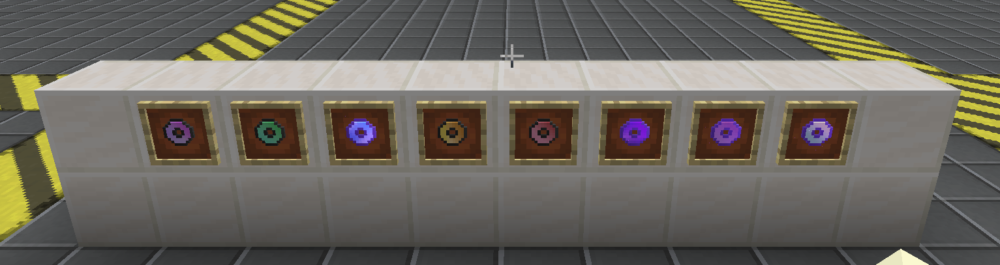
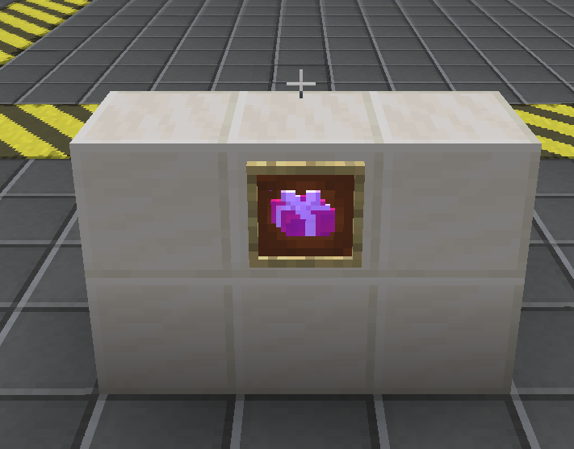

<h1 align="center">GT-Interesting-Thing</h1>
<p align="center"><strong><em>GTNH Interesting Gadgets Mod</em></strong><br><strong><em>GTNH 趣味道具模组</em></strong></p>

A GregTech New Horizons gadget mod that **provides interesting items enhancing the gameplay experience**, including flight cores, ore scanning tools, functional rings, a starter gift system, and a custom trading machine, while balancing usage costs to maintain progression integrity.

一个 GregTech New Horizons 趣味道具模组，**提供增强游玩体验的有趣物品**，包括浮空核心、探矿工具、功能性戒指、新手宝箱系统，以及自定义交易机器，同时平衡使用代价以保持进阶完整性。

> \[!NOTE]
> This is an unofficial mod. Please avoid discussing this mod in official GTNH forums.
> 这是一个非官方模组，讨论此模组时请注意场合。

## Downloads & Requirements / 下载与版本需求

| GTNH         | GTIT   | Maintenance / 维护 |
| ------------ | ------ | :--------------: |
| 2.9.0 beta-1 | 1.0.0+ |        ✔️        |
| 2.8.4        | 0.1.x  |        ❌️        |

***

## Neko Vending Machine / 猫猫售货机

<p align="center"></p>
<p align="center"></p>
<p align="center"><br><em>猫猫售货机界面 / Neko Vending Machine GUI</em></p>

A custom trading machine built on top of the VendingMachine framework, featuring an independent currency system (Neko Coin), dynamic tabbed GUI, BetterQuesting integration, and BGM. Designed as a progression-gated reward shop where players earn Neko Coins through quests and spend them on loot bags and items.

基于 VendingMachine 框架构建的自定义交易机器，拥有独立的货币系统（猫猫币）、动态标签页 GUI、BetterQuesting 任务集成和背景音乐。设计为进度门控奖励商店——玩家通过任务获取猫猫币，再消费猫猫币购买战利品袋和物品。

### Structure / 结构

A 2×2×1 multiblock machine (compact form of the original VendingMachine's 2×3×1). The controller must be placed at the bottom-right corner.

2×2×1 多方块机器（原版 VendingMachine 2×3×1 的紧凑版）。控制器必须放置在右下角。

```
┌────┬────┐
│ cc │ c~ │   cc = casing, c~ = controller (facing right)
└────┴────┘
```

### Currency System / 货币系统

Two types of Neko Coins, stored in an independent wallet system (not in player inventory):

两种猫猫币，存储在独立钱包系统中（不占用玩家背包）：

| Currency / 货币                | ID               | Description / 说明                                   |
| ---------------------------- | ---------------- | -------------------------------------------------- |
| Neko Coin / 猫猫币              | `neko`           | Basic currency, earned through BQ quest completion |
| Shimmering Neko Coin / 闪烁猫猫币 | `shimmeringNeko` | Premium currency, earned through harder quests     |

- **Team wallet / 团队钱包**: Wallets are shared among team members via GTNHLib Teams API. All members of the same team share a single wallet balance. (Since v1.5.1; v1.5.0 used per-player personal wallets stored in `<world>/gtit_neko_wallets/<uuid>.dat`)
- Neko Coins are automatically detected when placed in the trade edit inventory
- Coins are deducted via Mixin (not through the standard trade item exchange)
- **Cooldown scaling / 冷却缩放**: Trade cooldown limits scale with the number of online team members
- **团队钱包**：钱包通过 GTNHLib Teams API 在团队成员间共享，同团队的所有成员共享同一个钱包余额。（自 v1.5.1 起；v1.5.0 使用按玩家个人钱包，存储在 `<world>/gtit_neko_wallets/<uuid>.dat`）
- 在交易编辑界面放入猫猫币时自动识别为货币参数
- 猫猫币通过 Mixin 扣减（不走标准交易物品交换流程）
- **冷却缩放**：交易冷却上限随在线团队成员数缩放

### Trade System / 交易系统

Three trade types supported:

支持三种交易类型：

| Type / 类型             | Example / 示例                               |
| --------------------- | ------------------------------------------ |
| Pure Neko Coin / 纯猫猫币 | 100 Neko Coins → 1 Loot Bag                |
| Mixed / 混合交易          | 50 Neko Coins + 10 Iron Ingots → 1 Diamond |
| Item Exchange / 物品交换  | 10 Iron Ingots → 1 Diamond (no coins)      |

**Trade entry fields / 交易条目字段**:

- `tabId`: Which tab the trade appears in
- `orderId`: Sort order within the tab
- `currency`: Neko Coin cost (optional, auto-detected from inventory)
- `fromItems`: Required items (optional for pure coin trades)
- `toItems`: Reward items
- `cooldown`: Cooldown in seconds (0 = no cooldown)
- `bqQuestId`: BQ quest requirement (empty = no requirement)

### GUI & Tabs / 界面与标签页

- **Dynamic tabs / 动态标签页**: 3 default tabs + unlimited custom tabs (add via command with held item as icon)
- **Neko Coin display / 猫猫币显示**: Real-time balance display with expandable details
- **Coin intercept slot / 猫猫币拦截槽**: Automatically routes Neko Coins from inventory to wallet
- **Sort & Search / 排序与搜索**: Sort by order ID or name, with text search filtering
- **BGM / 背景音乐**: 3 random BGM variants with 2-second fade in/out, max 50% volume
- **BQ lock display / BQ 锁定显示**: Locked trades show golden "LOCKED" text with cooldown overlay; cooling-down trades show cyan cooldown text
- **动态标签页**：3 个默认标签页 + 无限自定义标签页（通过指令添加，手持物品作图标）
- **猫猫币显示**：实时余额显示，可展开详情
- **猫猫币拦截槽**：自动将背包中的猫猫币导入钱包
- **排序与搜索**：按顺序 ID 或名称排序，支持文字搜索过滤
- **背景音乐**：3 首随机 BGM，2 秒淡入淡出，最大音量 50%
- **BQ 锁定显示**：锁定交易显示金色 "LOCKED" 文字 + 冷却遮罩；冷却中交易显示青色冷却时间

### BetterQuesting Integration / BQ 任务集成

Trades can be locked behind BQ quest completion:

交易可绑定 BQ 任务作为前置条件：

- **Server-side lock / 服务端锁定**: `MixinMTEVendingMachine` checks BQ quest completion before currency deduction
- **Client-side display / 客户端显示**: `MixinTradeItemDisplayWidget` shows golden "LOCKED" overlay for locked trades
- **Event sync / 事件同步**: `BqEventBridge` listens for quest completion events and syncs to client cache
- **Sort optimization / 排序优化**: Locked trades are sorted after available trades (cooldown does not affect sort order)
- **bqQuestId formats / bqQuestId 格式**: Supports base64 (recommended, from BQ quest filename), `high:low`, and standard UUID
- **服务端锁定**：`MixinMTEVendingMachine` 在货币扣减前检查 BQ 任务完成状态
- **客户端显示**：`MixinTradeItemDisplayWidget` 为锁定交易显示金色 "LOCKED" 遮罩
- **事件同步**：`BqEventBridge` 监听任务完成事件并同步到客户端缓存
- **排序优化**：锁定交易排在可交易之后（冷却不影响排序）
- **bqQuestId 格式**：支持 base64（推荐，从 BQ 任务文件名复制）、`high:low`、标准 UUID

### Commands / 指令

All commands under `/gtit`, OP permission level 2. **Tab completion supported** for all subcommands, tab IDs, and order IDs.

所有指令通过 `/gtit`，OP 权限等级 2。**支持 Tab 补全**——子命令、标签页 ID、顺序 ID 均可自动补全。

```
/gtit
  ├── gift                          -- Starter gift config / 新手宝箱配置
  │   ├── certain                   -- Set guaranteed items from inventory
  │   ├── random <count>            -- Set random item pool from inventory
  │   └── reset                     -- Reset to default
  │
  └── nekovm                        -- NekoVM trade management / 猫猫机交易管理
      ├── edit <tabId> [orderId]    -- Edit/create trade (reads inventory)
      │            [cooldown] [bqQuestId]
      ├── list [tabId]              -- List trades
      ├── delete <tabId> <orderId>  -- Delete trade
      ├── page add <id> <name>      -- Add/override tab (held item = icon)
      ├── page delet <id>           -- Delete custom tab (1-3 protected)
      ├── reload                    -- Hot-reload config
      ├── save                      -- Save to config file
      ├── timereset                 -- Reset all trade cooldowns
      ├── edithelp                   -- Edit help
      ├── pagehelp                  -- Tab management help
      └── help                      -- Full help
```

**Edit inventory layout / 编辑物品布局**:

- Rows 1-2 (slots 9-26): Required items / Neko Coins (auto-detected)
- Hotbar slots 0-3: Reward items (slot 0 = trade icon)
- 背包前两行（槽位 9-26）：需求物品 / 猫猫币（自动识别）
- 工具栏前 4 格（槽位 0-3）：产物物品（槽位 0 = 交易图标）

### Configuration / 配置

| File / 文件     | Path / 路径                        | Description / 说明                                                                           |
| ------------- | -------------------------------- | ------------------------------------------------------------------------------------------ |
| Trades / 交易配置 | `config/gtit/nekovm_trades.json` | Trade entries with tabId, orderId, items, currency, cooldown, bqQuestId                    |
| Tabs / 标签页配置  | `config/gtit/nekovm_pages.json`  | Custom tab definitions (ID, name, icon)                                                    |
| Wallets / 钱包  | GTNHLib Teams team data          | Team-shared Neko Coin balances (v1.5.0: per-player `<world>/gtit_neko_wallets/<uuid>.dat`) |
| Gift / 新手宝箱   | `config/gtit/gift_config.json`   | Starter gift guaranteed + random items                                                     |

If `nekovm_trades.json` does not exist, default trades are generated from `NekoTradeConfig.getDefaultTrades()` (10 loot bag trades with BQ quest bindings).

如果 `nekovm_trades.json` 不存在，将从 `NekoTradeConfig.getDefaultTrades()` 生成默认交易（10 个带 BQ 任务绑定的战利品袋交易）。

### Mixin Architecture / Mixin 架构

| Mixin                         | Target                  | Function / 功能                                                                |
| ----------------------------- | ----------------------- | ---------------------------------------------------------------------------- |
| `MixinMTEVendingMachine`      | `processTradeOnServer`  | Neko Coin deduction + BQ lock check + cooldown check (before currency check) |
| `MixinTradeMainPanel`         | `TradeMainPanel`        | Filter Neko Coin trades from original VM GUI                                 |
| `MixinTradeItemDisplayWidget` | `draw()`                | Golden LOCKED text + cyan cooldown color via § codes                         |
| `MixinTradeManager`           | `TradeManager`          | Placeholder (canExecuteTrade dependency)                                     |
| `MixinPlayerControllerMP`     | `getBlockReachDistance` | Extend block reach distance for Ring of Distant Grasp                        |

***

## Items / 物品

### Float Core / 浮空核心

<p align="center"><br><em>浮空核心 / Float Core</em></p>

A simple yet powerful flight enabler. Equip to any Baubles slot to gain creative-like flight ability.

简单而强大的飞行道具。装备到任意 Baubles 饰品栏即可获得类似创造模式的飞行能力。

- Equip to any Baubles slot to gain flight
- Consumes hunger per tick while flying
- Automatically disables flight when hunger drops below 3 shanks (6 hunger points)
- Early-game accessible — no electricity required
- 装备到任意 Baubles 饰品栏即获得飞行能力
- 飞行时每 tick 消耗饥饿值
- 饥饿值低于3格（6点）时自动禁用飞行
- 前期即可获取——无需电力

***

### Electric Float Core / 电力浮空核心

<p align="center"><br><em>电力浮空核心 / Electric Float Core</em></p>

An upgraded version of the Float Core with massive EU storage. When electricity runs out, it falls back to hunger consumption at half the rate.

浮空核心的升级版，拥有超大 EU 容量。电力耗尽时回退至饥饿消耗，消耗量为浮空核心的一半。

- LV voltage tier, 32,000,000 EU capacity
- Consumes electricity while flying
- Falls back to hunger consumption when depleted (half rate of Float Core)
- Compatible with IC2 charging stations
- LV 电压等级，32,000,000 EU 容量
- 飞行时消耗电力
- 电力耗尽时消耗饥饿值（浮空核心的一半消耗率）
- 兼容 IC2 充电站

***

### Telekinesis Ore Scanner Core / 念力共振探矿核心

<p align="center"><br><em>念力共振探矿核心 / Telekinesis Ore Scanner Core</em></p>

A long-range ore and fluid prospecting tool that integrates with JourneyMap via VisualProspecting. Scan results are uploaded to the map automatically — you cannot view ore info directly, preserving the exploration challenge.

远程矿石和流体勘探工具，通过 VisualProspecting 与旅行地图集成。扫描结果自动上传至地图——无法直接获取矿石信息，保留探索挑战性。

- Right-click air or block to scan a 19×19 chunk area
- Consumes 6 hunger points per scan
- Data automatically uploaded to JourneyMap (requires VisualProspecting)
- Cannot view ore info directly — only map markers
- Shift + Right-click to switch between Ore / Fluid detection mode
- Requires VisualProspecting mod for map integration
- 右击空气或方块进行 19×19 区块大范围探矿
- 每次消耗 6 点饥饿值进行探矿
- 数据自动上传至旅行地图（需要 VisualProspecting）
- 无法直接获取矿石信息——仅显示地图标记
- Shift + 右键切换矿石/流体探测模式
- 需要 VisualProspecting 模组实现地图联动

***

### Infinity Cell / 无限存储元件

<p align="center"><br><em>ME无限存储元件 / ME Infinity Cell</em></p>

An AE2 storage cell with virtually infinite capacity. Data is externalized to a global WorldSavedData, avoiding NBT bloat. Available in both item and fluid variants.

基于 AE2 的无限容量存储元件，数据外部化存储在全局 WorldSavedData 中，避免 NBT 膨胀。提供物品版和流体版两种变体。

- **Capacity / 容量**: Integer.MAX\_VALUE types, 1 byte per type (effectively unlimited)
- **Idle drain / 空闲功耗**: 2000 AE/tick
- **Item variant / 物品版**: 2 upgrade card slots, supports partition editing
- **Fluid variant / 流体版**: 0 upgrade card slots, supports partition editing
- **Data storage / 数据存储**: Externalized via `StorageManager` (WorldSavedData), linked by UUID
- **Adapted from / 适配自**: AE2Things (GTNH 2.8.4), rewritten for GTNH 2.9.0 AE2 API
- 容量：Integer.MAX\_VALUE 种类型，每类型 1 字节（实际无限）
- 空闲功耗：2000 AE/tick
- 物品版：2 个升级卡槽，支持分区编辑
- 流体版：0 个升级卡槽，支持分区编辑
- 数据存储：通过 `StorageManager`（WorldSavedData）外部化，以 UUID 关联
- 适配自：AE2Things（GTNH 2.8.4），为 GTNH 2.9.0 AE2 API 重写

***

## Rings / 戒指

<p align="center"><br><em>8 枚功能性戒指 / 8 Functional Rings</em></p>

A set of 8 functional rings that equip to Baubles ring slots, providing various buffs and abilities. Rings are obtained from chest loot, crafting, or the starter gift.

8 枚功能性戒指，装备于 Baubles 戒指栏，提供各种增益和能力。戒指可通过宝箱战利品、合成或新手宝箱获得。

### Baubles Ring Slot Expansion / Baubles 戒指栏扩展

The mod expands the Baubles ring slots from **2 to 10** via the Baubles-Expanded API, allowing the player to equip multiple rings simultaneously and stack effects.

模组通过 Baubles-Expanded API 将戒指栏从 **2 个扩展到 10 个**，使玩家可以同时装备多枚戒指并叠加效果。

- Calls `BaubleExpandedSlots.tryAssignSlotsUpToMinimum("ring", 10)` during PreInit
- Falls back to `overrideSlots()` during Init to ensure correct slot ordering
- Automatically compatible with other mods using `BaublesApi.getBaubles()` (dynamic `getSizeInventory()`)
- 在 PreInit 阶段调用 `BaubleExpandedSlots.tryAssignSlotsUpToMinimum("ring", 10)`
- 在 Init 阶段通过 `overrideSlots()` 兜底，确保槽位顺序正确
- 自动兼容其他使用 `BaublesApi.getBaubles()` 遍历的模组（动态 `getSizeInventory()`）

### Ring List / 戒指总览

| # | Name / 名称                       | Effect / 效果                                                                                | Stackable / 叠加 |
| - | ------------------------------- | ------------------------------------------------------------------------------------------ | :------------: |
| 1 | Ring of Distant Grasp / 戒指·遥握   | Interaction & attack range +2 per ring / 交互与攻击距离 +2                                        |       ✔️       |
| 2 | Ring of Skywalk / 戒指·凌步         | Auto step-up 1 block / 自动走上 1 格方块                                                          |       ✖️       |
| 3 | Ring of Windrider / 戒指·御风       | Creative flight / 创造飞行                                                                     |       ✖️       |
| 4 | Ring of Gluttony / 戒指·饕餮        | Continuous hunger restore + emergency fill / 持续恢复饥饿度 + 应急饱食                                |       ✖️       |
| 5 | Ring of Ironheart / 戒指·磐躯       | Max health +20 per ring (10 hearts) / 生命上限 +20                                             |       ✔️       |
| 6 | Ring of Dragon's Breath / 戒指·龙息 | Fire Resistance + Night Vision + Regeneration I + Resistance I / 抗火 + 夜视 + 生命恢复 I + 抗性提升 I |       ✖️       |
| 7 | Ring of Mountainbreaker / 戒指·裂山 | Strength II + Haste II / 力量 II + 急迫 II                                                     |       ✖️       |
| 8 | Ring of Tempest / 戒指·疾风         | Speed II + Jump Boost II / 速度 II + 跳跃提升 II                                                 |       ✖️       |

### Ring Details / 戒指详情

- **Ring of Distant Grasp / 戒指·遥握**: Extends block reach distance via Mixin (`MixinPlayerControllerMP`). Each ring adds +2 blocks. Stackable — multiple rings compound the bonus.
- **Ring of Skywalk / 戒指·凌步**: Automatically steps up 1-block heights without jumping. Walks smoothly like flat ground.
- **Ring of Windrider / 戒指·御风**: Grants creative flight with no cost. Obtained only via crafting.
- **Ring of Gluttony / 戒指·饕餮**: Restores 1 hunger/sec; restores saturation when full. Emergency-fills hunger and saturation when below 5 (60s cooldown).
- **Ring of Ironheart / 戒指·磐躯**: Uses `SharedMonsterAttributes.maxHealth` Attribute Modifier. Each ring adds +20 max health (10 hearts). Stackable.
- **Ring of Dragon's Breath / 戒指·龙息**: Refreshes 30s potion effects every 5s — no flickering.
- **Ring of Mountainbreaker / 戒指·裂山**: Refreshes 30s potion effects every 5s.
- **Ring of Tempest / 戒指·疾风**: Refreshes 30s potion effects every 5s.
- **戒指·遥握**：通过 Mixin（`MixinPlayerControllerMP`）扩展方块交互距离，每枚 +2 格，可叠加。
- **戒指·凌步**：自动走上 1 格高方块，如履平地，无需跳跃。
- **戒指·御风**：获得创造飞行，无消耗。仅通过合成获得。
- **戒指·饕餮**：每秒恢复 1 点饥饿值，满后恢复饱和度；饥饿度低于 5 时一次性补满（冷却 60 秒）。
- **戒指·磐躯**：使用 `SharedMonsterAttributes.maxHealth` 属性修饰器，每枚 +20 生命上限（10 颗心），可叠加。
- **戒指·龙息**：每 5 秒刷新 30 秒药水效果——不会闪烁。
- **戒指·裂山**：每 5 秒刷新 30 秒药水效果。
- **戒指·疾风**：每 5 秒刷新 30 秒药水效果。

***

## Starter Gift / 新手宝箱

<p align="center"><br><em>新手宝箱 / Starter Gift</em></p>

A gift box automatically granted to players on their **first login** to a world. Right-click to open and receive a set of starter items — guaranteed items plus randomly drawn items from a configurable pool.

玩家**首次进入某个世界**时自动获得的新手宝箱。右击打开即可获得一系列新手物资——包含必中物品和从随机物品池中抽取的随机物品。

- Auto-granted on first world login (tracked via persisted NBT)
- Right-click to open: grants guaranteed items + random items
- Items drop to the ground if inventory is full
- Fully configurable via `config/gtit/gift_config.json`
- Default random pool includes 6 rings (Skywalk, Gluttony, Ironheart, Dragon's Breath, Mountainbreaker, Tempest)
- 首次进入世界自动发放（通过持久化 NBT 追踪）
- 右击打开：获得必中物品 + 随机物品
- 背包满了物品丢到地上
- 通过 `config/gtit/gift_config.json` 完全可配置
- 默认随机池包含 6 枚戒指（凌步、饕餮、磐躯、龙息、裂山、疾风）

### Gift Config / 宝箱配置

```json
{
  "guaranteed_items": [
    { "item": "minecraft:bread", "amount": 16, "meta": 0 },
    { "item": "minecraft:torch", "amount": 64, "meta": 0 }
  ],
  "random_items": [
    { "item": "gtit:ring_skywalk", "amount": 1, "meta": 0 }
  ],
  "random_count": 2
}
```

- `guaranteed_items`: Items always granted / 必中物品
- `random_items`: Random item pool / 随机物品池
- `random_count`: Number of random items drawn / 随机抽取数量

### Gift Commands / 宝箱指令

| Command / 指令                | Description / 说明                                                   |
| --------------------------- | ------------------------------------------------------------------ |
| `/gtit gift certain`        | Set guaranteed items from current inventory / 将当前背包物品设为必中物品        |
| `/gtit gift random <count>` | Set random pool from inventory + set draw count / 将背包物品设为随机池并设置抽取数 |
| `/gtit gift reset`          | Reset to default config / 恢复默认配置                                   |

***

## Multiblock Test Machine / 多方块测试机器

A test multiblock machine (HV tier) for verifying the multiblock registration process, structure detection logic, and recipe system integration. Uses a 3×3×3 hollow TungstenSteel structure.

测试用多方块机器（HV 级），用于验证多方块机器的注册流程、结构检测逻辑及配方系统。采用 3×3×3 空心钨钢结构。

***

## Tech Stack / 技术栈

- Java 8 (JVM Downgrader) / Minecraft 1.7.10 / Forge 10.13.4.1614
- ModularUI / ModularUI2 / StructureLib
- Dependencies: GT5-Unofficial (5.09.52.594), GTNHLib, VisualProspecting, Baubles-Expanded, IC2

***

## Acknowledgments / 致谢

- **[AE2Things](https://github.com/GTNewHorizons/AE2Things)** — The Infinity Cell implementation is adapted from AE2Things' storage cell code, rewritten for the GTNH 2.9.0 AE2 API.
  无限存储元件的实现适配自 AE2Things 的存储元件代码，为 GTNH 2.9.0 AE2 API 重写。
- **[VendingMachine](https://github.com/GTNewHorizons/VendingMachine)** — The Neko Vending Machine is built on top of the VendingMachine framework, with custom currency, GUI, and trade logic.
  猫猫售货机基于 VendingMachine 框架构建，包含自定义货币、界面和交易逻辑。

***

## License / 许可证

See LICENSE file.
详见 LICENSE 文件。
