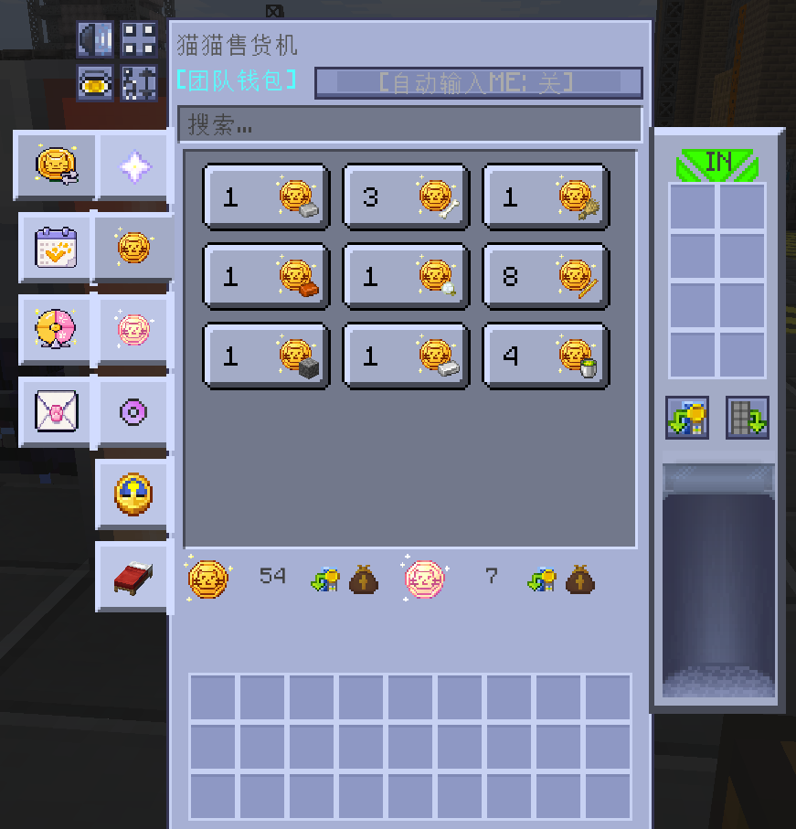
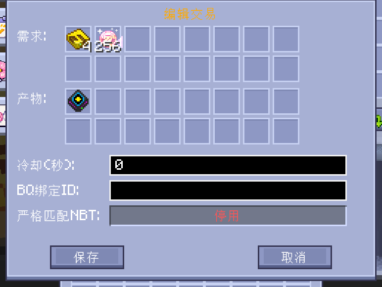
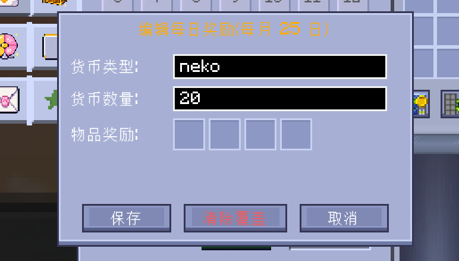
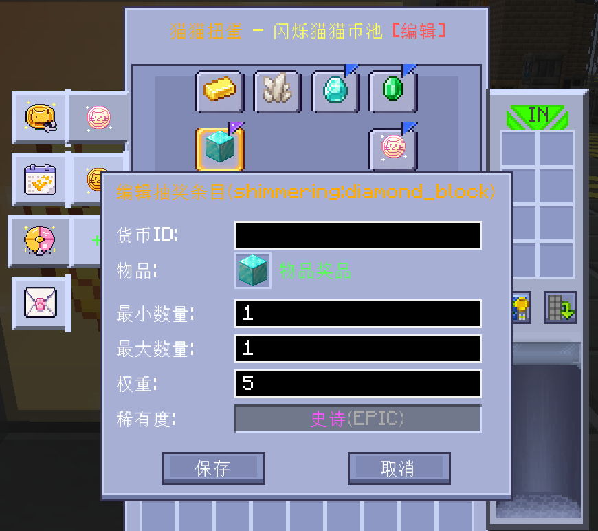
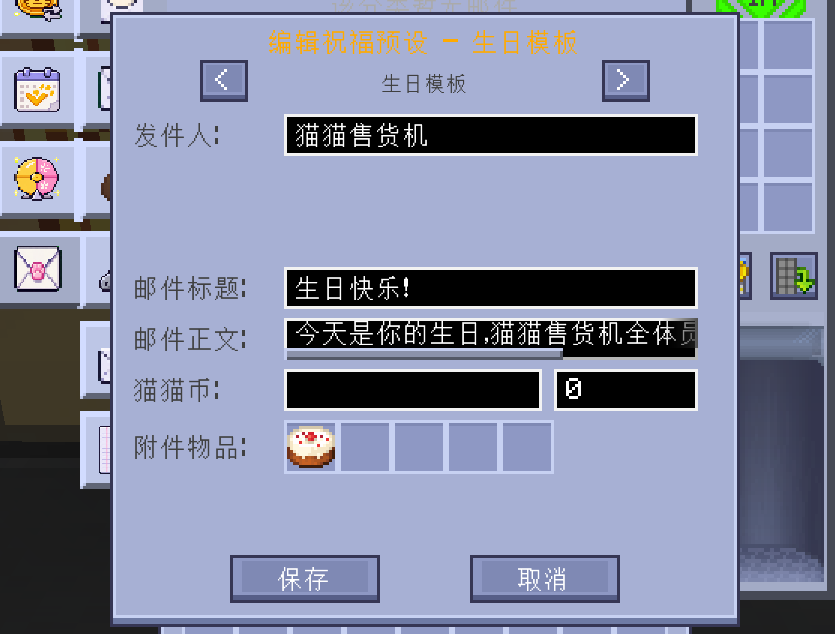
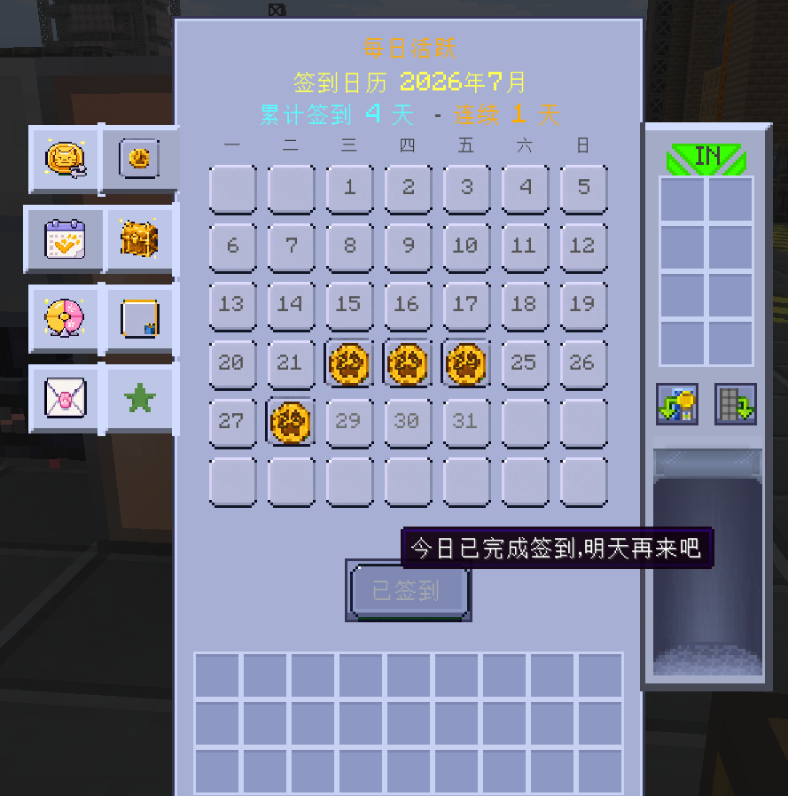
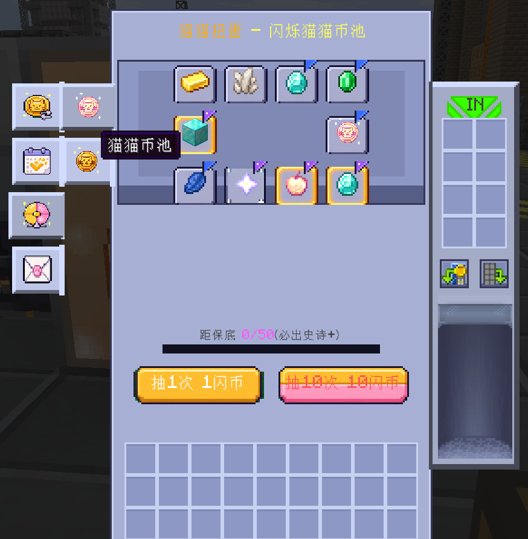
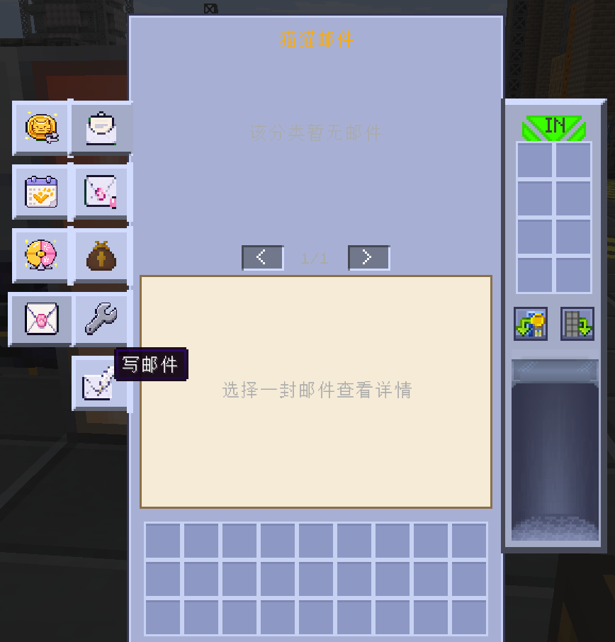

<h1 align="center">GT-Interesting-Thing</h1>
<p align="center"><strong><em>GTNH 趣味道具模组</em></strong><br><strong><em>GTNH Interesting Gadgets Mod</em></strong></p>

<p align="center">
  <a href="LICENSE"></a>
  
  
  <a href="https://github.com/GTNewHorizons/GT-New-Horizons-Modpack"></a>
  <a href="https://github.com/MIAOKATZE/GT-Interesting-Thing/releases"></a>
</p>

A GregTech New Horizons gadget mod that **provides interesting items enhancing the gameplay experience**, including flight cores, ore scanning tools, functional rings, a starter gift system, and a custom trading machine, while balancing usage costs to maintain progression integrity.

一个 GregTech New Horizons 趣味道具模组，**提供增强游玩体验的有趣物品**，包括浮空核心、探矿工具、功能性戒指、新手宝箱系统，以及自定义交易机器，同时平衡使用代价以保持进阶完整性。

> \[!NOTE]
> This is an unofficial mod. Please avoid discussing this mod in official GTNH forums.
> 这是一个非官方模组，讨论此模组时请注意场合。

## Downloads & Requirements / 下载与版本需求

| GTNH         | GTIT   | Maintenance / 维护 |
| ------------ | ------ | :--------------: |
| 2.9.0 beta-1&2 | 1.0.0+ (current: 1.7.53 / 当前：1.7.53) | ✔️ |
| 2.8.4        | 0.1.x  |        ❌️        |

Current version 1.7.53 comes from `gradle.properties` (`RELEASE_VERSION`); the latest workflow record is v1.7.53. No external release status is claimed here.

当前版本 1.7.53 取自 `gradle.properties` 的 `RELEASE_VERSION`；workflow 文档最新记录为 v1.7.53。此处不声明对外发布状态。

***

## Neko Vending Machine / 猫猫售货机

<p align="center"></p>
<p align="center"><br><em>猫猫售货机界面 / Neko Vending Machine GUI</em></p>

A custom trading machine — since V2 an independently implemented multiblock built on GT5U's `MTEEnhancedMultiBlockBase` (the early prototype originated from the VendingMachine mod) — featuring an independent currency system (Neko Coin), dynamic tabbed GUI, BetterQuesting integration, and BGM. Designed as a progression-gated reward shop where players earn Neko Coins through quests and spend them on loot bags and items.

自定义交易机器——V2 起为基于 GT5U `MTEEnhancedMultiBlockBase` 独立实现的多方块机器（开发早期原型源自 VendingMachine 模组），拥有独立的货币系统（猫猫币）、动态标签页 GUI、BetterQuesting 任务集成和背景音乐。设计为进度门控奖励商店——玩家通过任务获取猫猫币，再消费猫猫币购买战利品袋和物品。

### Currency System / 货币系统

Two types of Neko Coins, stored in an independent wallet system (not in player inventory):

两种猫猫币，存储在独立钱包系统中（不占用玩家背包）：

| Currency / 货币                | ID               | Description / 说明                                   |
| ---------------------------- | ---------------- | -------------------------------------------------- |
| Neko Coin / 猫猫币              | `neko`           | Basic currency, earned through BQ quest completion |
| Shimmering Neko Coin / 闪烁猫猫币 | `shimmeringNeko` | Premium currency, earned through harder quests     |

- **Team wallet / 团队钱包**: Wallets are shared among team members via GTNHLib Teams API. All members of the same team share a single wallet balance. (Since v1.5.1; v1.5.0 used per-player personal wallets stored in `<world>/gtit_neko_wallets/<uuid>.dat`)
- Neko Coins are automatically detected when placed in the trade edit inventory
- Coins are deducted natively from the wallet by V2's own trade executor (`NekoWallet.tryDeduct`, atomic), no Mixin involved
- **Cooldown scaling / 冷却缩放**: Trade cooldown limits scale with the number of online team members
- **团队钱包**：钱包通过 GTNHLib Teams API 在团队成员间共享，同团队的所有成员共享同一个钱包余额。（自 v1.5.1 起；v1.5.0 使用按玩家个人钱包，存储在 `<world>/gtit_neko_wallets/<uuid>.dat`）
- 在交易编辑界面放入猫猫币时自动识别为货币参数
- 猫猫币由 V2 自身交易执行器从钱包原生扣减（`NekoWallet.tryDeduct`，原子操作），不经由 Mixin
- **冷却缩放**：交易冷却上限随在线团队成员数缩放

### Trade System / 交易系统

Three trade types supported:

支持三种交易类型：

| Type / 类型             | Example / 示例                               |
| --------------------- | ------------------------------------------ |
| Pure Neko Coin / 纯猫猫币 | 100 Neko Coins → 1 Loot Bag                |
| Mixed / 混合交易          | 50 Neko Coins + 10 Iron Ingots → 1 Diamond |
| Item Exchange / 物品交换  | 10 Iron Ingots → 1 Diamond (no coins)      |

**Trade entry fields / 交易条目字段**:

- `tabId`: Which tab the trade appears in
- `orderId`: Sort order within the tab
- `currency`: Neko Coin cost (optional, auto-detected from inventory)
- `fromItems`: Required items (optional for pure coin trades)
- `toItems`: Reward items
- `cooldown`: Cooldown in seconds (0 = no cooldown)
- `bqQuestId`: BQ quest requirement (empty = no requirement)

### GUI & Tabs / 界面与标签页

<p align="center"><br><em>交易界面 / Trade GUI</em></p>

- **Dynamic tabs / 动态标签页**: 3 default tabs + unlimited custom tabs (add via command with held item as icon)
- **Neko Coin display / 猫猫币显示**: Real-time balance display with expandable details
- **Coin intercept slot / 猫猫币拦截槽**: Automatically routes Neko Coins from inventory to wallet
- **Sort & Search / 排序与搜索**: Sort by order ID or name, with text search filtering
- **BGM / 背景音乐**: 3 random BGM variants with 2-second fade in/out, max 50% volume
- **BQ lock display / BQ 锁定显示**: Locked trades show golden "LOCKED" text with cooldown overlay; cooling-down trades show cyan cooldown text
- **动态标签页**：3 个默认标签页 + 无限自定义标签页（通过指令添加，手持物品作图标）
- **猫猫币显示**：实时余额显示，可展开详情
- **猫猫币拦截槽**：自动将背包中的猫猫币导入钱包
- **排序与搜索**：按顺序 ID 或名称排序，支持文字搜索过滤
- **背景音乐**：3 首随机 BGM，2 秒淡入淡出，最大音量 50%
- **BQ 锁定显示**：锁定交易显示金色 "LOCKED" 文字 + 冷却遮罩；冷却中交易显示青色冷却时间

### BetterQuesting Integration / BQ 任务集成

Trades can be locked behind BQ quest completion:

交易可绑定 BQ 任务作为前置条件：

- **Server-side lock / 服务端锁定**: `NekoBqCondition` (a V2 trade condition) checks BQ quest completion before the trade executes
- **Client-side display / 客户端显示**: `NekoTradeDisplayWidgetV2` shows golden "LOCKED" overlay for locked trades
- **Event sync / 事件同步**: `NekoBqBridge` listens for quest completion events and maintains a completion cache
- **Sort optimization / 排序优化**: Locked trades are sorted after available trades (cooldown does not affect sort order)
- **bqQuestId formats / bqQuestId 格式**: Supports base64 (recommended, from BQ quest filename), `high:low`, and standard UUID
- **服务端锁定**：`NekoBqCondition`（V2 交易条件）在交易执行前检查 BQ 任务完成状态
- **客户端显示**：`NekoTradeDisplayWidgetV2` 为锁定交易显示金色 "LOCKED" 遮罩
- **事件同步**：`NekoBqBridge` 监听任务完成事件并维护完成状态缓存
- **排序优化**：锁定交易排在可交易之后（冷却不影响排序）
- **bqQuestId 格式**：支持 base64（推荐，从 BQ 任务文件名复制）、`high:low`、标准 UUID

### Visual Editor / 可视化编辑

Enable with `/gtit nekovm edit on` (see [Administrator Commands](#administrator-commands--管理员命令)), then click trade entries in the machine GUI to edit them visually.

通过 `/gtit nekovm edit on` 开启（见[管理员命令](#administrator-commands--管理员命令)），在售货机 GUI 内点击交易条目即可进行可视化编辑。

<p align="center"></p>
<p align="center"></p>


### Configuration / 配置

| File / 文件              | Path / 路径                                | Description / 说明                                                            |
| --------------------- | --------------------------------------- | -------------------------------------------------------------------------- |
| Trades / 交易配置         | `config/gtit/trade/trades/tab_<id>.json` | Trade entries with tabId, orderId, items (optionally with `nbtBase64`), currency, cooldown, bqQuestId |
| Tabs / 标签页配置          | `config/gtit/trade/pages.json`          | Custom tab definitions (ID, name, icon)                                     |
| Trade ledger / 贸易整合记账 | `config/gtit/trade/integrated/`         | Version ledger for integrated trade groups (delete a file to force re-registration) |
| Lottery pools / 抽奖卡池   | `config/gtit/lottery/lottery.json`      | Gacha pool definitions (pools with entries, cost items, pity config)        |
| Lottery ledger / 抽奖整合记账 | `config/gtit/lottery/integrated/`       | Version ledger for integrated lottery pool groups                           |
| Wallets / 钱包          | GTNHLib Teams team data                 | Team-shared Neko Coin balances (v1.5.0: per-player `<world>/gtit_neko_wallets/<uuid>.dat`) |
| Gift / 新手宝箱           | `config/gtit/gift_config.json`          | Starter gift guaranteed + random items (optionally with `nbtBase64`)        |

If no trade config exists, default trades are generated from built-in defaults on first launch; with `enhancedDefaultTrades` enabled, the bundled base trade group from jar assets takes over instead.

如果交易配置不存在，首次启动时将生成默认交易；开启增强默认交易（`enhancedDefaultTrades`）时，由 jar 内置基础贸易组替代内置默认交易。

### Third-party Integration API / 第三方整合 API

Register external trade groups and lottery pool groups from your own mod via three interchangeable channels, all funnelling into the same idempotent, version-ledgered pipeline:

- **Java direct call / Java 直调**: `NekoTradeIntegrationAPI.registerTradeGroup(NekoTradeGroupDef)` / `LotteryIntegrationAPI.registerLotteryPool(LotteryPoolGroupDef)` — thread-safe, queued until the server is ready.
- **IMC**: `FMLInterModComms.sendMessage("gtit", "gtit:registerTradeGroup" | "gtit:registerTradeAsset" | "gtit:registerLotteryPool", nbt)` with the definition JSON in the NBT string field (`groupJson` / `tradeAssetJson`).
- **jar assets / jar 资产清单（BQ 式）**: ship `assets/<your-modid>/gtit/trade/index.json` + `groups/*.json` and `assets/<your-modid>/gtit/lottery/index.json` + `pools/*.json` inside your jar (an explicit manifest — jar directories are not enumerable on 1.7.10), then call `NekoTradeIntegrationAPI.registerTradeAssetsFromJar("<your-modid>")` / `LotteryIntegrationAPI.registerLotteryPoolsFromJar("<your-modid>")` in `postInit`.

Minimal example / 最小示例：

```java
// postInit（物品注册完成后）
NekoTradeIntegrationAPI.registerTradeAssetsFromJar("mymod");
LotteryIntegrationAPI.registerLotteryPoolsFromJar("mymod");

// 或程序化直调（def JSON 模型见 NekoTradeGroupDef / LotteryPoolGroupDef）
NekoTradeIntegrationAPI.registerTradeGroup(def);
LotteryIntegrationAPI.registerLotteryPool(poolGroupDef);
```

Idempotence & version ledger / 幂等与版本记账：each group is recorded in `config/gtit/trade/integrated/<groupId>.json` or `config/gtit/lottery/integrated/<groupId>.json` with its source version. Same version → skipped (player edits to `tab_*.json` / `lottery.json` stay authoritative); version bump → old content is removed per the ledger and re-registered; deleting the ledger file forces re-registration. Pools/trades owned by the player's local config are never silently overwritten (WARN + skip on conflict).

每个组在 `config/gtit/{trade,lottery}/integrated/<groupId>.json` 记账：版本未变跳过（玩家对 `tab_*.json` / `lottery.json` 的编辑保持权威）；版本变化按记账移除旧内容后重注册；删除记账文件即强制重注册；玩家本地配置占用的池/交易不会被静默覆盖（冲突 WARN 跳过）。

Full schema, ledger semantics walkthrough and the content-author workflow: local working notes `plan/wiki/integration-assets-api.md` (kept out of git per repo convention); durable entries in the MIAO GTNH wiki: `mods/gtit/integration/assets-api.md` and `mods/gtit/lottery/lottery-draw-algorithm.md`.

完整 schema、版本记账语义图解与内容作者工作流见本地工作树文档 `plan/wiki/integration-assets-api.md`（按仓库惯例不入库）；持久版本见 MIAO GTNH wiki 条目 `mods/gtit/integration/assets-api.md` 与 `mods/gtit/lottery/lottery-draw-algorithm.md`。


### Mixin Architecture / Mixin 架构

Since V2, trade logic (currency deduction, BQ locks, cooldowns) is handled natively by the mod's own machine and trade-executor classes instead of Mixins. The remaining Mixins cover rings, neko BGM, and compatibility:

自 V2 起交易逻辑（货币扣减、BQ 锁定、冷却）由模组自身的机器与交易执行类原生处理，不再经由 Mixin。现存 Mixin 覆盖戒指、猫猫 BGM 与兼容性：

| Mixin                              | Target                                     | Function / 功能                                             |
| ---------------------------------- | ------------------------------------------ | ----------------------------------------------------------- |
| `MixinPlayerControllerMP`           | `PlayerControllerMP.getBlockReachDistance` | Client-side block reach extension for Ring of Distant Grasp |
| `MixinItemInWorldManager`           | `ItemInWorldManager.getBlockReachDistance` | Server-side block reach extension for Ring of Distant Grasp |
| `NekoSoundManagerMixin`             | `SoundManager.playSound`                   | Capture neko BGM sound source for per-frame volume control  |
| `MixinAEBaseGuiDrawHoveringTextFix` | `GuiScreen.drawHoveringText`               | Fix AE2 tooltip `AbstractMethodError` under Angelica         |

Sound-mute Mixins are listed in the [Machine Sound Mute](#machine-sound-mute--机器音效静音) section.

机器音效静音相关 Mixin 见[机器音效静音](#machine-sound-mute--机器音效静音)章节。

***

## Daily Sign-In / 每日签到

<p align="center"><br><em>签到界面 / Sign-In GUI</em></p>

A daily reward system that grants players cumulative rewards for logging in each day, with optional online-time tier bonuses.

每日签到系统，玩家每日登录可领取累积奖励，并支持按在线时长解锁额外档位奖励。

***

## Lottery / 抽奖

<p align="center"><br><em>抽奖界面 / Lottery GUI</em></p>

A gacha-style reward pool where players spend Neko Coins or items to draw random rewards.

消耗猫猫币或物品进行随机抽奖的奖励池系统。

***

## Mail / 邮件

<p align="center"><br><em>邮件界面 / Mail GUI</em></p>

An in-game mail system for receiving rewards, announcements, and attachments from server operators or automated events.

游戏内邮件系统，用于接收管理员或自动事件发放的奖励、公告与附件。

***

## Items / 物品

### Float Core / 浮空核心

<p align="center"><br><em>浮空核心 / Float Core</em></p>

A simple yet powerful flight enabler. Equip to any Baubles slot to gain creative-like flight ability.

简单而强大的飞行道具。装备到任意 Baubles 饰品栏即可获得类似创造模式的飞行能力。

- Equip to any Baubles slot to gain flight
- Consumes hunger per tick while flying
- Automatically disables flight when hunger drops below 3 shanks (6 hunger points)
- Early-game accessible — no electricity required
- 装备到任意 Baubles 饰品栏即获得飞行能力
- 飞行时每 tick 消耗饥饿值
- 饥饿值低于3格（6点）时自动禁用飞行
- 前期即可获取——无需电力

***

### Electric Float Core / 电力浮空核心

<p align="center"><br><em>电力浮空核心 / Electric Float Core</em></p>

An upgraded version of the Float Core with massive EU storage. When electricity runs out, it falls back to hunger consumption at half the rate.

浮空核心的升级版，拥有超大 EU 容量。电力耗尽时回退至饥饿消耗，消耗量为浮空核心的一半。

- LV voltage tier, 32,000,000 EU capacity
- Consumes electricity while flying
- Falls back to hunger consumption when depleted (half rate of Float Core)
- Compatible with IC2 charging stations
- LV 电压等级，32,000,000 EU 容量
- 飞行时消耗电力
- 电力耗尽时消耗饥饿值（浮空核心的一半消耗率）
- 兼容 IC2 充电站

***

### Telekinesis Ore Scanner Core / 念力共振探矿核心

<p align="center"><br><em>念力共振探矿核心 / Telekinesis Ore Scanner Core</em></p>

A long-range ore and fluid prospecting tool that integrates with JourneyMap via VisualProspecting. Scan results are uploaded to the map automatically — you cannot view ore info directly, preserving the exploration challenge.

远程矿石和流体勘探工具，通过 VisualProspecting 与旅行地图集成。扫描结果自动上传至地图——无法直接获取矿石信息，保留探索挑战性。

- Right-click air or block to scan a 19×19 chunk area
- Consumes 6 hunger points per scan
- Data automatically uploaded to JourneyMap (requires VisualProspecting)
- Cannot view ore info directly — only map markers
- Shift + Right-click to switch between Ore / Fluid detection mode
- Requires VisualProspecting mod for map integration
- 右击空气或方块进行 19×19 区块大范围探矿
- 每次消耗 6 点饥饿值进行探矿
- 数据自动上传至旅行地图（需要 VisualProspecting）
- 无法直接获取矿石信息——仅显示地图标记
- Shift + 右键切换矿石/流体探测模式
- 需要 VisualProspecting 模组实现地图联动

***

### Infinity Cell / 无限存储元件

<p align="center"><br><em>ME无限存储元件 / ME Infinity Cell</em></p>

An AE2 storage cell with virtually infinite capacity. Data is externalized to a global WorldSavedData, avoiding NBT bloat. Available in both item and fluid variants.

基于 AE2 的无限容量存储元件，数据外部化存储在全局 WorldSavedData 中，避免 NBT 膨胀。提供物品版和流体版两种变体。

- **Capacity / 容量**: Integer.MAX\_VALUE types, 1 byte per type (effectively unlimited)
- **Idle drain / 空闲功耗**: 2000 AE/tick
- **Item variant / 物品版**: 2 upgrade card slots, supports partition editing
- **Fluid variant / 流体版**: 0 upgrade card slots, supports partition editing
- **Data storage / 数据存储**: Externalized via `StorageManager` (WorldSavedData), linked by UUID
- **Adapted from / 适配自**: AE2Things (GTNH 2.8.4), rewritten for GTNH 2.9.0 AE2 API
- 容量：Integer.MAX\_VALUE 种类型，每类型 1 字节（实际无限）
- 空闲功耗：2000 AE/tick
- 物品版：2 个升级卡槽，支持分区编辑
- 流体版：0 个升级卡槽，支持分区编辑
- 数据存储：通过 `StorageManager`（WorldSavedData）外部化，以 UUID 关联
- 适配自：AE2Things（GTNH 2.8.4），为 GTNH 2.9.0 AE2 API 重写

***

## Rings / 戒指

<p align="center"><br><em>8 枚功能性戒指 / 8 Functional Rings</em></p>

A set of 8 functional rings that equip to Baubles ring slots, providing various buffs and abilities. Rings are obtained from chest loot, crafting, or the starter gift.

8 枚功能性戒指，装备于 Baubles 戒指栏，提供各种增益和能力。戒指可通过宝箱战利品、合成或新手宝箱获得。

### Baubles Ring Slot Expansion / Baubles 戒指栏扩展

The mod expands the Baubles ring slots from **2 to 10** via the Baubles-Expanded API, allowing the player to equip multiple rings simultaneously and stack effects.

模组通过 Baubles-Expanded API 将戒指栏从 **2 个扩展到 10 个**，使玩家可以同时装备多枚戒指并叠加效果。

- Calls `BaubleExpandedSlots.tryAssignSlotsUpToMinimum("ring", 10)` during PreInit
- Falls back to `overrideSlots()` during Init to ensure correct slot ordering
- Automatically compatible with other mods using `BaublesApi.getBaubles()` (dynamic `getSizeInventory()`)
- 在 PreInit 阶段调用 `BaubleExpandedSlots.tryAssignSlotsUpToMinimum("ring", 10)`
- 在 Init 阶段通过 `overrideSlots()` 兜底，确保槽位顺序正确
- 自动兼容其他使用 `BaublesApi.getBaubles()` 遍历的模组（动态 `getSizeInventory()`）

### Ring List / 戒指总览

| # | Name / 名称                       | Effect / 效果                                                                                | Stackable / 叠加 |
| - | ------------------------------- | ------------------------------------------------------------------------------------------ | :------------: |
| 1 | Ring of Distant Grasp / 戒指·遥握   | Interaction & attack range +2 per ring / 交互与攻击距离 +2                                        |       ✔️       |
| 2 | Ring of Skywalk / 戒指·凌步         | Auto step-up 1 block / 自动走上 1 格方块                                                          |       ✖️       |
| 3 | Ring of Windrider / 戒指·御风       | Creative flight / 创造飞行                                                                     |       ✖️       |
| 4 | Ring of Gluttony / 戒指·饕餮        | Continuous hunger restore + emergency fill / 持续恢复饥饿度 + 应急饱食                                |       ✖️       |
| 5 | Ring of Ironheart / 戒指·磐躯       | Max health +20 per ring (10 hearts) / 生命上限 +20                                             |       ✔️       |
| 6 | Ring of Dragon's Breath / 戒指·龙息 | Fire Resistance + Night Vision + Regeneration I + Resistance I / 抗火 + 夜视 + 生命恢复 I + 抗性提升 I |       ✖️       |
| 7 | Ring of Mountainbreaker / 戒指·裂山 | Strength II + Haste II / 力量 II + 急迫 II                                                     |       ✖️       |
| 8 | Ring of Tempest / 戒指·疾风         | Speed II + Jump Boost II / 速度 II + 跳跃提升 II                                                 |       ✖️       |

### Ring Details / 戒指详情

- **Ring of Distant Grasp / 戒指·遥握**: Extends block reach distance via Mixin (`MixinPlayerControllerMP`). Each ring adds +2 blocks. Stackable — multiple rings compound the bonus.
- **Ring of Skywalk / 戒指·凌步**: Automatically steps up 1-block heights without jumping. Walks smoothly like flat ground.
- **Ring of Windrider / 戒指·御风**: Grants creative flight with no cost. Obtained only via crafting.
- **Ring of Gluttony / 戒指·饕餮**: Restores 1 hunger/sec; restores saturation when full. Emergency-fills hunger and saturation when below 5 (60s cooldown).
- **Ring of Ironheart / 戒指·磐躯**: Uses `SharedMonsterAttributes.maxHealth` Attribute Modifier. Each ring adds +20 max health (10 hearts). Stackable.
- **Ring of Dragon's Breath / 戒指·龙息**: Refreshes 30s potion effects every 5s — no flickering.
- **Ring of Mountainbreaker / 戒指·裂山**: Refreshes 30s potion effects every 5s.
- **Ring of Tempest / 戒指·疾风**: Refreshes 30s potion effects every 5s.
- **戒指·遥握**：通过 Mixin（`MixinPlayerControllerMP`）扩展方块交互距离，每枚 +2 格，可叠加。
- **戒指·凌步**：自动走上 1 格高方块，如履平地，无需跳跃。
- **戒指·御风**：获得创造飞行，无消耗。仅通过合成获得。
- **戒指·饕餮**：每秒恢复 1 点饥饿值，满后恢复饱和度；饥饿度低于 5 时一次性补满（冷却 60 秒）。
- **戒指·磐躯**：使用 `SharedMonsterAttributes.maxHealth` 属性修饰器，每枚 +20 生命上限（10 颗心），可叠加。
- **戒指·龙息**：每 5 秒刷新 30 秒药水效果。
- **戒指·裂山**：每 5 秒刷新 30 秒药水效果。
- **戒指·疾风**：每 5 秒刷新 30 秒药水效果。

***

## Starter Gift / 新手宝箱

<p align="center"><br><em>新手宝箱 / Starter Gift</em></p>

A gift box automatically granted to players on their **first login** to a world. Right-click to open and receive a set of starter items — guaranteed items plus randomly drawn items from a configurable pool.

玩家**首次进入某个世界**时自动获得的新手宝箱。右击打开即可获得一系列新手物资——包含必中物品和从随机物品池中抽取的随机物品。

- Auto-granted on first world login (tracked via persisted NBT)
- Right-click to open: grants guaranteed items + random items
- Items drop to the ground if inventory is full
- Fully configurable via `config/gtit/gift_config.json`
- Default random pool includes 6 rings (Skywalk, Gluttony, Ironheart, Dragon's Breath, Mountainbreaker, Tempest)
- 首次进入世界自动发放（通过持久化 NBT 追踪）
- 右击打开：获得必中物品 + 随机物品
- 背包满了物品丢到地上
- 通过 `config/gtit/gift_config.json` 完全可配置
- 默认随机池包含 6 枚戒指（凌步、饕餮、磐躯、龙息、裂山、疾风）

### Gift Config / 宝箱配置

```json
{
  "guaranteed_items": [
    { "item": "minecraft:bread", "amount": 16, "meta": 0 },
    { "item": "minecraft:torch", "amount": 64, "meta": 0 }
  ],
  "random_items": [
    { "item": "gtit:ring_skywalk", "amount": 1, "meta": 0 },
    { "item": "minecraft:enchanted_book", "amount": 1, "meta": 0, "nbtBase64": "..." }
  ],
  "random_count": 2
}
```

- `guaranteed_items`: Items always granted / 必中物品
- `random_items`: Random item pool / 随机物品池
- `random_count`: Number of random items drawn / 随机抽取数量
- `nbtBase64` (optional): Base64-encoded NBT data; written automatically when using `yesNBT` / 可选，Base64 编码的 NBT 数据；使用 `yesNBT` 时自动写入

***

## Machine Sound Mute / 机器音效静音

Two QoL configs controlling GT5U machine sounds. Config file: `config/gtit/gtit_mute.json`.

两项 GT5U 机器音效静音配置。配置文件：`config/gtit/gtit_mute.json`。

```json
{
  "_comment_mute": "mute_machine_working_sounds=true 时：新放置机器默认静音（有 GUI 按钮的机器可单独取消静音）。",
  "mute_machine_working_sounds": false,
  "_comment_extra_mute": "extra_mute=true 时：额外强制拦截无静音按钮机器的音效（锅炉蒸汽排放音/锅炉沸腾加热循环音/管道蒸汽泄漏音），不受 GUI 按钮控制。",
  "extra_mute": false
}
```

### `mute_machine_working_sounds`

- **`false` (default)**: No intervention. Players can toggle each machine's mute button in its GUI.
- **`true`**: Newly placed machines (or those without a saved mute state) default to muted; players can still unmute per-machine via the GUI button.
- **`false`（默认）**：不干预，玩家可通过每台机器 GUI 右上角的静音按钮单独控制。
- **`true`**：新放置或未保存过静音状态的机器默认静音；玩家仍可通过 GUI 按钮单独取消。

### `extra_mute`

For machines **without** a GUI mute button (boilers, fluid pipes). Force-cancels their sounds regardless of any state.

针对**没有** GUI 静音按钮的机器（锅炉、流体管道）。无论状态如何，强制拦截其音效。

- **`false` (default)**: No intervention.
- **`true`**: Force-cancel boiler steam-vent sound (`ventSteamIfTankIsFull` → `sendSound`), boiler boiling/heating loop sounds, and fluid pipe steam-leak sound.
- **`false`（默认）**：不干预。
- **`true`**：强制拦截锅炉蒸汽满罐排放音（`ventSteamIfTankIsFull` → `sendSound`）、锅炉沸腾/加热循环音、流体管道蒸汽泄漏音。

### Mixin Architecture / Mixin 架构

| Mixin                              | Target                              | Config                | Function / 功能                                                                                |
| ---------------------------------- | ----------------------------------- | --------------------- | ---------------------------------------------------------------------------------------------- |
| `MixinBaseMetaTileEntityMuffle`    | `setInitialValuesAsNBT` (TAIL)      | `mute_machine_working_sounds` | Default new machines to `mMuffler=true`; GUI button still works per-machine                   |
| `MixinMTEBrickedBlastFurnace`      | `updateSound` (HEAD)                | `mute_machine_working_sounds` | Cancel brick blast furnace flame loop sound                                                    |
| `MixinMTEBlackHoleCompressor`      | `playBlackHoleSounds` (HEAD)        | `mute_machine_working_sounds` | Cancel black hole compressor loop sound                                                        |
| `MixinMTEBoilerVentSteam`          | `MTEBoiler.doSound` (HEAD)          | `extra_mute`          | Cancel boiler steam vent sound + particle (`SOUND_EVENT_LET_OFF_EXCESS_STEAM`)                 |
| `MixinMTEBoilerSoundLoops`         | `updateSoundLoops` (HEAD)           | `extra_mute`          | Cancel boiler boiling/heating loop sounds (`GTCEU_LOOP_BOILER` / `GTCEU_LOOP_FURNACE`)         |
| `MixinMTEFluidPipeSound`           | `MTEFluidPipe.doSound` (HEAD)       | `extra_mute`          | Cancel fluid pipe steam-leak sound (`aIndex==9`, `RANDOM_FIZZ`)                                |

***

## Multiblock Test Machine / 多方块测试机器

A development-stage test multiblock (HV tier, 3×3×3 hollow TungstenSteel) once used to verify the multiblock registration process, structure detection logic, and recipe system integration. It was removed in v1.6.30 — the Neko Vending Machine V2, built directly on GT5U's `MTEEnhancedMultiBlockBase`, has since taken over this role.

开发阶段用于验证多方块机器注册流程、结构检测逻辑及配方系统的测试多方块（HV 级，3×3×3 空心钨钢结构）。该测试机已于 v1.6.30 移除——直接基于 GT5U `MTEEnhancedMultiBlockBase` 构建的猫猫售货机 V2 已承接其职责。

***

## Administrator Commands / 管理员命令

All commands under `/gtit`, OP permission level 2. **Tab completion supported** for subcommands, tab IDs, order IDs, and player names. Subcommands that manipulate the executor's own inventory are player-only; the rest also work from the server console.

所有指令通过 `/gtit`，OP 权限等级 2。**支持 Tab 补全**——子命令、标签页 ID、顺序 ID、玩家名均可自动补全。需要操作执行者背包的子命令仅玩家可执行，其余支持服务器控制台。

### Starter Gift / 新手宝箱

| Command / 指令                                | Description / 说明                                                               |
| ------------------------------------------- | ------------------------------------------------------------------------------ |
| `/gtit gift certain [yesNBT\|noNBT]`        | Set guaranteed items from current inventory / 将当前背包物品设为必中物品；默认 `noNBT`       |
| `/gtit gift random <count> [yesNBT\|noNBT]` | Set random pool from inventory + draw count / 将背包物品设为随机池并设置抽取数；默认 `noNBT`   |
| `/gtit gift reset`                          | Reset to default config / 恢复默认配置                                                 |
| `/gtit gift claimlist`                      | List players who claimed the gift (online + offline) / 列出已领取玩家（在线+离线）          |
| `/gtit gift claimreset [all\|玩家名]`         | Reset claim status; re-gift on next login / 重置领取状态，玩家下次登录时自动发放（支持离线玩家） |

### NekoVM / 猫猫售货机

| Command / 指令                | Description / 说明                                                        |
| --------------------------- | ------------------------------------------------------------------------ |
| `/gtit nekovm edit on\|off` | Toggle visual config edit mode / 开关可视化配置编辑模式                              |
| `/gtit nekovm reload`       | Hot-reload trade + tab config / 热重载交易与标签页配置                                |
| `/gtit nekovm timereset`    | Reset all trade cooldowns of the executor's team / 重置当前玩家（团队）的全部交易冷却 |
| `/gtit nekovm help`         | Full help / 完整帮助                                                              |

### Sign-In / 每日签到

| Command / 指令                              | Description / 说明                                                        |
| ----------------------------------------- | ------------------------------------------------------------------------ |
| `/gtit signin`                            | Player self sign-in, same as the GUI button / 玩家自助签到，与签到 GUI 按钮等效（仅玩家） |
| `/gtit signin info [玩家名]`                | View sign-in status (online players only) / 查看签到状态（目标仅支持在线玩家）        |
| `/gtit signin reload`                     | Hot-reload sign-in + online-time reward config / 热重载签到与在线时长奖励配置        |
| `/gtit signin admin set <玩家名> <天数>`     | Set consecutive sign-in days / 设置连续签到天数（在线玩家）                          |
| `/gtit signin admin reset <玩家名>`         | Reset a player's sign-in data / 重置玩家签到数据（在线玩家）                          |
| `/gtit signin help`                        | Full help / 完整帮助                                                              |

### Lottery / 抽奖

| Command / 指令           | Description / 说明                        |
| ---------------------- | ---------------------------------------- |
| `/gtit lottery reload` | Hot-reload lottery pool config / 热重载抽奖卡池配置 |
| `/gtit lottery help`   | Full help / 完整帮助                                 |

### Mail / 邮件

| Command / 指令                              | Description / 说明                                                                                       |
| ----------------------------------------- | ------------------------------------------------------------------------------------------------------ |
| `/gtit mail send <玩家名> <标题> [正文...]`   | Send mail; attachment = held item (console sends as "系统" without attachment) / 发送邮件；附件=执行者手持物品（控制台以「系统」名义发送、无附件） |
| `/gtit mail first <标题> [正文...]`           | Set first-login reward template, overwrites the old one / 设置首登奖励模板（覆盖旧模板；仅玩家）                  |
| `/gtit mail firstclear`                   | Clear the first-login reward template / 清除首登奖励模板                                                  |
| `/gtit mail once <奖励ID> <标题> [正文...]`    | Publish a one-time reward; every player receives it once / 发布一次性奖励，全体玩家各收一次（奖励 ID 不可重复）      |
| `/gtit mail help`                      | Full help / 完整帮助                                                                                      |

A literal `\n` in mail bodies is converted to a line break. / 邮件正文中字面 `\n` 会被转换为换行。

***

## Tech Stack / 技术栈

- Jabel (modern Java syntax, Java 8 bytecode) / Minecraft 1.7.10 / Forge 10.13.4.1614
- ModularUI / ModularUI2 / StructureLib
- Dependencies: GT5-Unofficial (5.09.52.594), GTNHLib, VisualProspecting, Baubles-Expanded, IC2; VendingMachine 0.4.87 (dev local jar; the V2 multiblock's structure casing and uplink hatch are still provided by VendingMachine at runtime), BetterQuesting 3.8.72 (compileOnly)
- Jabel（现代 Java 语法，编译为 Java 8 字节码）/ Minecraft 1.7.10 / Forge 10.13.4.1614
- 依赖：GT5-Unofficial（5.09.52.594）、GTNHLib、VisualProspecting、Baubles-Expanded、IC2；VendingMachine 0.4.87（dev 本地 jar；V2 多方块的结构外壳与上行仓仍由 VendingMachine 提供运行时支持）、BetterQuesting 3.8.72（compileOnly）

***

## License / 许可证

Released under the BSD 3-Clause License. See the LICENSE file for details.

以 BSD 3-Clause 许可证发布，详见 LICENSE 文件。

***

## Acknowledgments / 致谢

- **[AE2Things](https://github.com/asdflj/AE2Things)** — The Infinity Cell implementation is adapted from AE2Things' storage cell code (GTNH 2.8.4 version), rewritten for the GTNH 2.9.0 AE2 API.
  无限存储元件的实现移植自 AE2Things 的存储元件代码（GTNH 2.8.4 版本），为 GTNH 2.9.0 AE2 API 重写。
- **[VendingMachine](https://github.com/GTNewHorizons/VendingMachine)** — The Neko Vending Machine originated on top of the VendingMachine framework, with custom currency, GUI, and trade logic, before being rebuilt as the independent V2 multiblock on GT5U.
  猫猫售货机最初基于 VendingMachine 框架构建（自定义货币、界面与交易逻辑），后重构为基于 GT5U 的独立 V2 多方块机器。
