<p align="center">
  
</p>

<h1 align="center">GT-Interesting-Thing</h1>
<p align="center"><strong><em>GTNH 趣味道具模组</em></strong><br><strong><em>GTNH Interesting Gadgets Mod</em></strong></p>

<p align="center">
  <a href="LICENSE"></a>
  
  
  <a href="https://github.com/GTNewHorizons/GT-New-Horizons-Modpack"></a>
  <a href="https://github.com/MIAOKATZE/GT-Interesting-Thing/releases"></a>
</p>

A GregTech New Horizons gadget mod that **provides interesting items enhancing the gameplay experience**, including flight cores, ore scanning tools, functional rings, a starter gift system, a hardcore reincarnation cycle, and a custom trading machine, while balancing usage costs to maintain progression integrity.

一个 GregTech New Horizons 趣味道具模组，**提供增强游玩体验的有趣物品**，包括浮空核心、探矿工具、功能性戒指、新手宝箱系统、周目轮回系统，以及自定义交易机器，同时平衡使用代价以保持进阶完整性。

> \[!NOTE]
> This is an unofficial mod. Please avoid discussing this mod in official GTNH forums.
> 这是一个非官方模组，讨论此模组时请注意场合。

## Downloads & Requirements / 下载与版本需求

| GTNH         | GTIT   | Maintenance / 维护 |
| ------------ | ------ | :--------------: |
| 2.9.0 beta-1&2&3 | **1.8.0 +**（当前 / current） |        ✔️        |
| 2.9.0 beta-1&2 | 1.0.0~1.7.53| ✔️ |
| 2.8.4        | 0.1.x  |        ❌️        |

The current version comes from `gradle.properties` (`RELEASE_VERSION`); development history is recorded under `plan/workflow/`. No external release status is claimed here.

当前版本取自 `gradle.properties` 的 `RELEASE_VERSION`；开发历史见 `plan/workflow/`。此处不声明对外发布状态。

***

## Neko Vending Machine / 猫猫售货机

<p align="center"></p>
<p align="center"><br><em>猫猫售货机界面 / Neko Vending Machine GUI</em></p>

A custom trading machine — since V2 an independently implemented multiblock built on GT5U's `MTEEnhancedMultiBlockBase` (the early prototype originated from the VendingMachine mod) — featuring an independent currency system (Neko Coin), dynamic tabbed GUI, BetterQuesting integration, and BGM. Designed as a progression-gated reward shop where players earn Neko Coins through quests and spend them on loot bags and items.

自定义交易机器——V2 起为基于 GT5U `MTEEnhancedMultiBlockBase` 独立实现的多方块机器（开发早期原型源自 VendingMachine 模组），拥有独立的货币系统（猫猫币）、动态标签页 GUI、BetterQuesting 任务集成和背景音乐。设计为进度门控奖励商店——玩家通过任务获取猫猫币，再消费猫猫币购买战利品袋和物品。

### Currency System / 货币系统

Two types of Neko Coins, stored in an independent wallet system (not in player inventory):

两种猫猫币，存储在独立钱包系统中（不占用玩家背包）：

| Currency / 货币                | ID               | Description / 说明                                   |
| ---------------------------- | ---------------- | -------------------------------------------------- |
| Neko Coin / 猫猫币              | `neko`           | Basic currency, earned through BQ quest completion |
| Shimmering Neko Coin / 闪烁猫猫币 | `shimmeringNeko` | Premium currency, earned through harder quests     |

- **Team wallet / 团队钱包**: Wallets are shared among team members via GTNHLib Teams API. All members of the same team share a single wallet balance. (Since v1.5.1; v1.5.0 used per-player personal wallets stored in `<world>/gtit_neko_wallets/<uuid>.dat`)
- Neko Coins are automatically detected when placed in the trade edit inventory
- Coins are deducted natively from the wallet by V2's own trade executor (`NekoWallet.tryDeduct`, atomic), no Mixin involved
- **Cooldown scaling / 冷却缩放**: Trade cooldown limits scale with the number of online team members
- **团队钱包**：钱包通过 GTNHLib Teams API 在团队成员间共享，同团队的所有成员共享同一个钱包余额。（自 v1.5.1 起；v1.5.0 使用按玩家个人钱包，存储在 `<world>/gtit_neko_wallets/<uuid>.dat`）
- 在交易编辑界面放入猫猫币时自动识别为货币参数
- 猫猫币由 V2 自身交易执行器从钱包原生扣减（`NekoWallet.tryDeduct`，原子操作），不经由 Mixin
- **冷却缩放**：交易冷却上限随在线团队成员数缩放

### Trade System / 交易系统

Three trade types supported:

支持三种交易类型：

| Type / 类型             | Example / 示例                               |
| --------------------- | ------------------------------------------ |
| Pure Neko Coin / 纯猫猫币 | 100 Neko Coins → 1 Loot Bag                |
| Mixed / 混合交易          | 50 Neko Coins + 10 Iron Ingots → 1 Diamond |
| Item Exchange / 物品交换  | 10 Iron Ingots → 1 Diamond (no coins)      |

**Trade entry fields / 交易条目字段**:

- `tabId`: Which tab the trade appears in
- `orderId`: Sort order within the tab
- `currency`: Neko Coin cost (optional, auto-detected from inventory)
- `fromItems`: Required items (optional for pure coin trades)
- `toItems`: Reward items
- `cooldown`: Cooldown in seconds (0 = no cooldown)
- `bqQuestId`: BQ quest requirement (empty = no requirement)

### GUI & Tabs / 界面与标签页

<p align="center">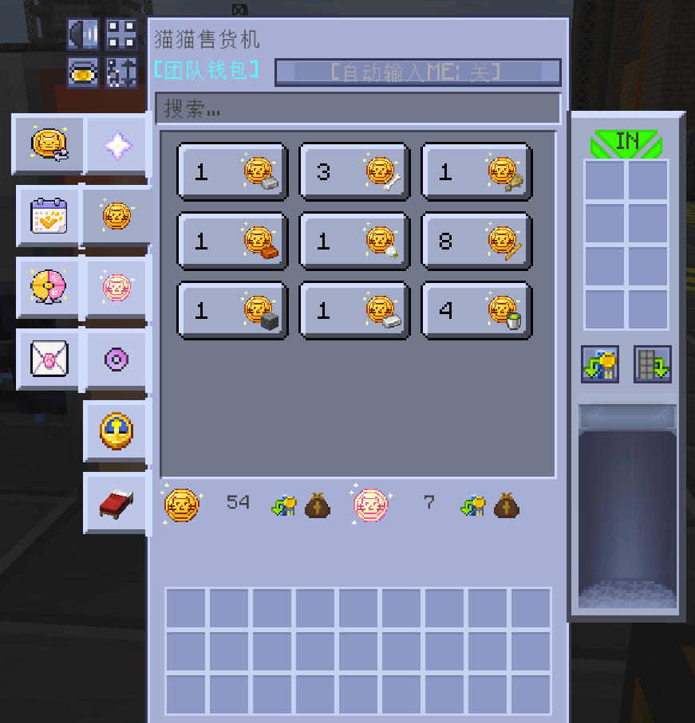<br><em>交易界面 / Trade GUI</em></p>

- **Dynamic tabs / 动态标签页**: 3 default tabs + unlimited custom tabs (add via command with held item as icon)
- **Neko Coin display / 猫猫币显示**: Real-time balance display with expandable details
- **Coin intercept slot / 猫猫币拦截槽**: Automatically routes Neko Coins from inventory to wallet
- **Sort & Search / 排序与搜索**: Sort by order ID or name, with text search filtering
- **BGM / 背景音乐**: 3 random BGM variants with 2-second fade in/out, max 50% volume
- **BQ lock display / BQ 锁定显示**: Locked trades show golden "LOCKED" text with cooldown overlay; cooling-down trades show cyan cooldown text
- **动态标签页**：3 个默认标签页 + 无限自定义标签页（通过指令添加，手持物品作图标）
- **猫猫币显示**：实时余额显示，可展开详情
- **猫猫币拦截槽**：自动将背包中的猫猫币导入钱包
- **排序与搜索**：按顺序 ID 或名称排序，支持文字搜索过滤
- **背景音乐**：3 首随机 BGM，2 秒淡入淡出，最大音量 50%
- **BQ 锁定显示**：锁定交易显示金色 "LOCKED" 文字 + 冷却遮罩；冷却中交易显示青色冷却时间

### BetterQuesting Integration / BQ 任务集成

Trades can be locked behind BQ quest completion:

交易可绑定 BQ 任务作为前置条件：

- **Server-side lock / 服务端锁定**: `NekoBqCondition` (a V2 trade condition) checks BQ quest completion before the trade executes
- **Client-side display / 客户端显示**: `NekoTradeDisplayWidgetV2` shows golden "LOCKED" overlay for locked trades
- **Event sync / 事件同步**: `NekoBqBridge` listens for quest completion events and maintains a completion cache
- **Sort optimization / 排序优化**: Locked trades are sorted after available trades (cooldown does not affect sort order)
- **bqQuestId formats / bqQuestId 格式**: Supports base64 (recommended, from BQ quest filename), `high:low`, and standard UUID
- **服务端锁定**：`NekoBqCondition`（V2 交易条件）在交易执行前检查 BQ 任务完成状态
- **客户端显示**：`NekoTradeDisplayWidgetV2` 为锁定交易显示金色 "LOCKED" 遮罩
- **事件同步**：`NekoBqBridge` 监听任务完成事件并维护完成状态缓存
- **排序优化**：锁定交易排在可交易之后（冷却不影响排序）
- **bqQuestId 格式**：支持 base64（推荐，从 BQ 任务文件名复制）、`high:low`、标准 UUID

### Visual Editor / 可视化编辑

Enable with `/gtit nekovm edit on` (see [Administrator Commands](#administrator-commands--管理员命令)), then click trade entries in the machine GUI to edit them visually. The editing surface covers seven domains: trades, tab pages, lottery entries, lottery pools, sign-in rewards, online-time tiers, and blessings.

通过 `/gtit nekovm edit on` 开启（见[管理员命令](#administrator-commands--管理员命令)），在售货机 GUI 内点击交易条目即可进行可视化编辑。编辑面现覆盖七个域：交易条目、标签页、抽奖条目、抽奖卡池、签到奖励、在线时长档位与祝福。

<p align="center">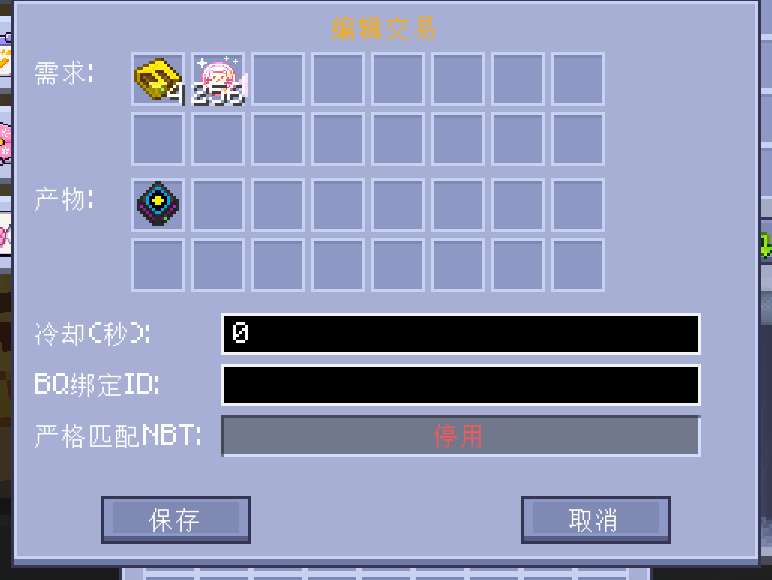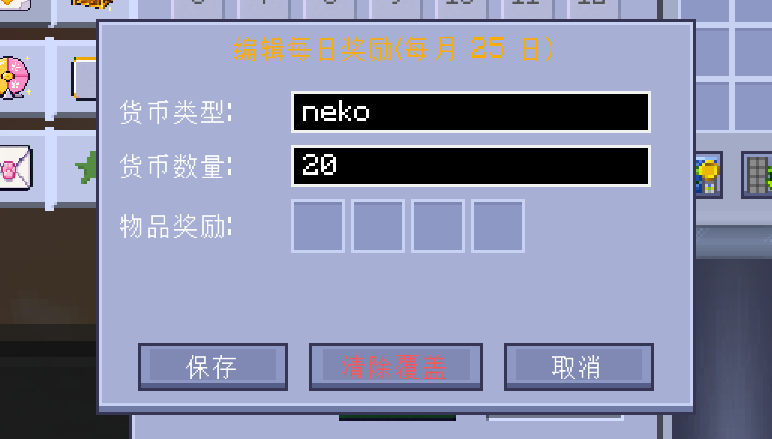</p>
<p align="center">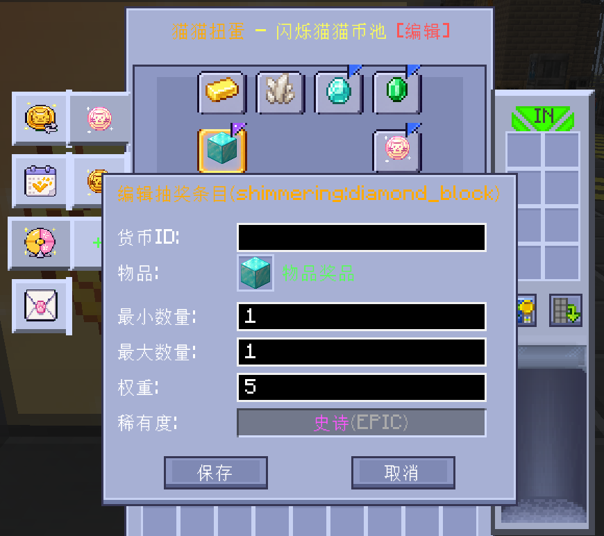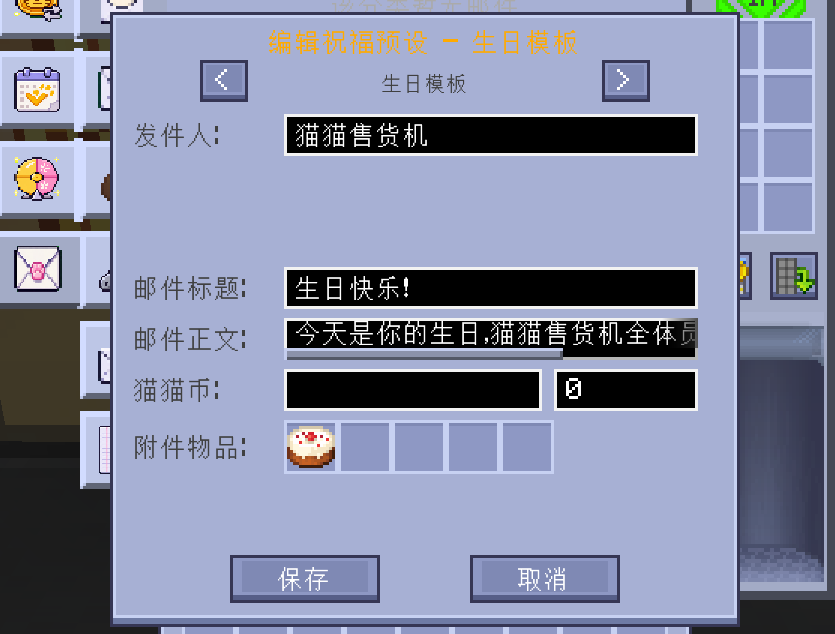</p>


### Configuration / 配置

| File / 文件              | Path / 路径                                | Description / 说明                                                            |
| --------------------- | --------------------------------------- | -------------------------------------------------------------------------- |
| Trades / 交易配置         | `config/gtit/trade/trades/tab_<id>.json` | Trade entries with tabId, orderId, items (optionally with `nbtBase64`), currency, cooldown, bqQuestId |
| Tabs / 标签页配置          | `config/gtit/trade/pages.json`          | Custom tab definitions (ID, name, icon)                                     |
| Trade ledger / 贸易整合记账 | `config/gtit/trade/integrated/`         | Version ledger for integrated trade groups (delete a file to force re-registration) |
| Lottery pools / 抽奖卡池   | `config/gtit/lottery/lottery.json`      | Gacha pool definitions (pools with entries, cost items, pity config)        |
| Lottery ledger / 抽奖整合记账 | `config/gtit/lottery/integrated/`       | Version ledger for integrated lottery pool groups                           |
| Wallets / 钱包          | GTNHLib Teams team data                 | Team-shared Neko Coin balances (v1.5.0: per-player `<world>/gtit_neko_wallets/<uuid>.dat`) |
| Gift / 新手宝箱           | `config/gtit/gift_config.json`          | Starter gift guaranteed + random items (optionally with `nbtBase64`)        |

If no trade config exists, default trades are generated from built-in defaults on first launch; with `enhancedDefaultTrades` enabled, the bundled base trade group from jar assets takes over instead.

如果交易配置不存在，首次启动时将生成默认交易；开启增强默认交易（`enhancedDefaultTrades`）时，由 jar 内置基础贸易组替代内置默认交易。

### Third-party Integration API / 第三方整合 API

Register external trade groups and lottery pool groups from your own mod via three interchangeable channels, all funnelling into the same idempotent, version-ledgered pipeline:

- **Java direct call / Java 直调**: `NekoTradeIntegrationAPI.registerTradeGroup(NekoTradeGroupDef)` / `LotteryIntegrationAPI.registerLotteryPool(LotteryPoolGroupDef)` — thread-safe, queued until the server is ready.
- **IMC**: `FMLInterModComms.sendMessage("gtit", "gtit:registerTradeGroup" | "gtit:registerTradeAsset" | "gtit:registerLotteryPool", nbt)` with the definition JSON in the NBT string field (`groupJson` / `tradeAssetJson`).
- **jar assets / jar 资产清单（BQ 式）**: ship `assets/<your-modid>/gtit/trade/index.json` + `groups/*.json` and `assets/<your-modid>/gtit/lottery/index.json` + `pools/*.json` inside your jar (an explicit manifest — jar directories are not enumerable on 1.7.10), then call `NekoTradeIntegrationAPI.registerTradeAssetsFromJar("<your-modid>")` / `LotteryIntegrationAPI.registerLotteryPoolsFromJar("<your-modid>")` in `postInit`.

Minimal example / 最小示例：

```java
// postInit（物品注册完成后）
NekoTradeIntegrationAPI.registerTradeAssetsFromJar("mymod");
LotteryIntegrationAPI.registerLotteryPoolsFromJar("mymod");

// 或程序化直调（def JSON 模型见 NekoTradeGroupDef / LotteryPoolGroupDef）
NekoTradeIntegrationAPI.registerTradeGroup(def);
LotteryIntegrationAPI.registerLotteryPool(poolGroupDef);
```

Idempotence & version ledger / 幂等与版本记账：each group is recorded in `config/gtit/trade/integrated/<groupId>.json` or `config/gtit/lottery/integrated/<groupId>.json` with its source version. Same version → skipped (player edits to `tab_*.json` / `lottery.json` stay authoritative); version bump → old content is removed per the ledger and re-registered; deleting the ledger file forces re-registration. Pools/trades owned by the player's local config are never silently overwritten (WARN + skip on conflict).

每个组在 `config/gtit/{trade,lottery}/integrated/<groupId>.json` 记账：版本未变跳过（玩家对 `tab_*.json` / `lottery.json` 的编辑保持权威）；版本变化按记账移除旧内容后重注册；删除记账文件即强制重注册；玩家本地配置占用的池/交易不会被静默覆盖（冲突 WARN 跳过）。

Full schema, ledger semantics walkthrough and the content-author workflow: local working notes `plan/wiki/integration-assets-api.md` (kept out of git per repo convention); durable entries in the MIAO GTNH wiki: `mods/gtit/integration/assets-api.md` and `mods/gtit/lottery/lottery-draw-algorithm.md`.

完整 schema、版本记账语义图解与内容作者工作流见本地工作树文档 `plan/wiki/integration-assets-api.md`（按仓库惯例不入库）；持久版本见 MIAO GTNH wiki 条目 `mods/gtit/integration/assets-api.md` 与 `mods/gtit/lottery/lottery-draw-algorithm.md`。


### Mixin Architecture / Mixin 架构

Since V2, trade logic (currency deduction, BQ locks, cooldowns) is handled natively by the mod's own machine and trade-executor classes instead of Mixins. The remaining Mixins cover rings, neko BGM, fishing coins, reincarnation ascension, and compatibility:

自 V2 起交易逻辑（货币扣减、BQ 锁定、冷却）由模组自身的机器与交易执行类原生处理，不再经由 Mixin。现存 Mixin 覆盖戒指、猫猫 BGM、钓鱼猫猫币、周目升天与兼容性：

| Mixin                              | Target                                     | Function / 功能                                             |
| ---------------------------------- | ------------------------------------------ | ----------------------------------------------------------- |
| `MixinPlayerControllerMP`           | `PlayerControllerMP.getBlockReachDistance` | Client-side block reach extension for Ring of Distant Grasp |
| `MixinItemInWorldManager`           | `ItemInWorldManager.getBlockReachDistance` | Server-side block reach extension for Ring of Distant Grasp |
| `NekoSoundManagerMixin`             | `SoundManager.playSound`                   | Capture neko BGM sound source for per-frame volume control  |
| `MixinAEBaseGuiDrawHoveringTextFix` | `GuiScreen.drawHoveringText`               | Fix AE2 tooltip `AbstractMethodError` under Angelica         |
| `MixinEntityFishHook`               | `EntityFishHook` fish-catching roll        | Server-side bonus Neko Coin / Shimmering Neko Coin on each successful player catch (default 10% / 2%, config-tunable; machine fish farms get nothing — anti-farm) / 玩家每次成功钓鱼服务端掷概率附赠猫猫币/闪烁猫猫币（默认 10%/2%，Config 可调；机器渔场不产，防刷币） |
| `MixinEntityRenderer`               | `EntityRenderer.setupCameraTransform`      | Reincarnation ascension camera warp (read-only replica of vanilla portal dizziness, hard-gated to the 120t cutscene window) / 周目升天相机 warp（只读复刻原版传送门眩晕，120t 演出窗口硬门控） |

Sound-mute Mixins are listed in the [Machine Sound Mute](#machine-sound-mute--机器音效静音) section.

机器音效静音相关 Mixin 见[机器音效静音](#machine-sound-mute--机器音效静音)章节。

***

## Daily Sign-In / 每日签到

<p align="center">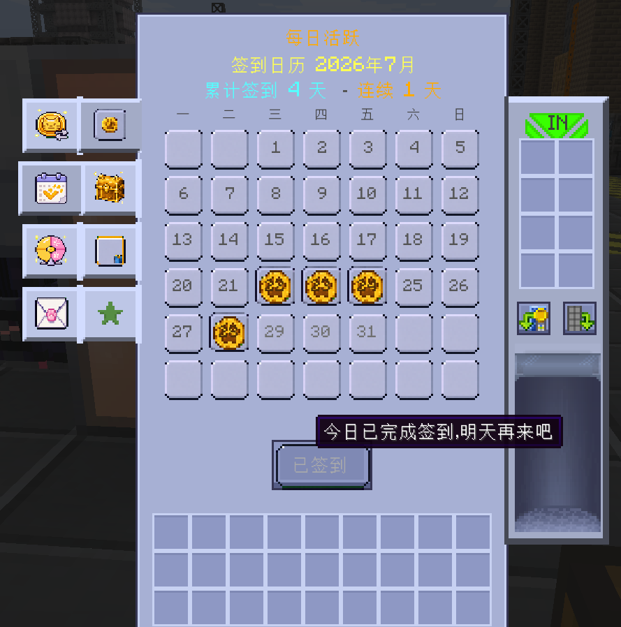<br><em>签到界面 / Sign-In GUI</em></p>

A daily reward system that grants players cumulative rewards for logging in each day, with optional online-time tier bonuses.

每日签到系统，玩家每日登录可领取累积奖励，并支持按在线时长解锁额外档位奖励。

***

## Lottery / 抽奖

<p align="center">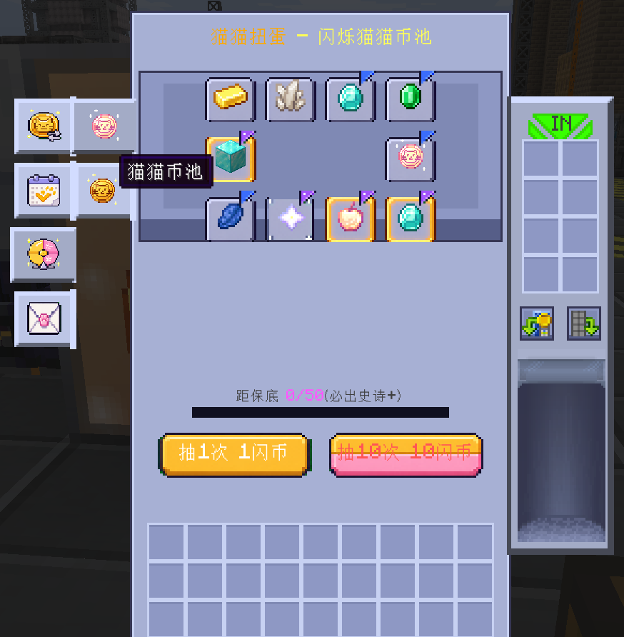<br><em>抽奖界面 / Lottery GUI</em></p>

A gacha-style reward pool where players spend Neko Coins or items to draw random rewards.

消耗猫猫币或物品进行随机抽奖的奖励池系统。

***

## Mail / 邮件

<p align="center">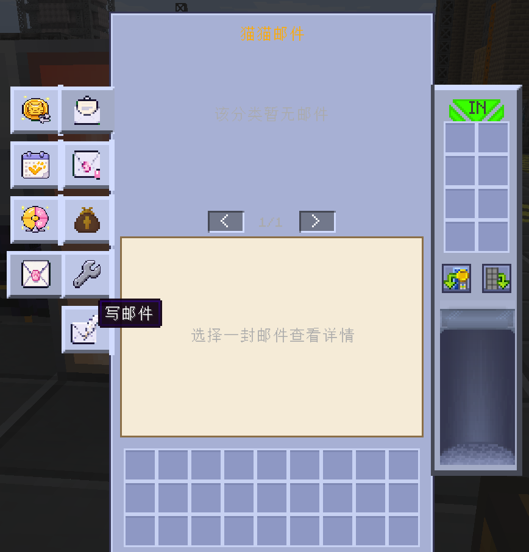<br><em>邮件界面 / Mail GUI</em></p>

An in-game mail system for receiving rewards, announcements, and attachments from server operators or automated events.

游戏内邮件系统，用于接收管理员或自动事件发放的奖励、公告与附件。

***

## Items / 物品

### Float Core / 浮空核心

<p align="center"><br><em>浮空核心 / Float Core</em></p>

A simple yet powerful flight enabler. Equip to any Baubles slot to gain creative-like flight ability.

简单而强大的飞行道具。装备到任意 Baubles 饰品栏即可获得类似创造模式的飞行能力。

- Equip to any Baubles slot to gain flight
- Consumes hunger per tick while flying
- Automatically disables flight when hunger drops below 3 shanks (6 hunger points)
- Early-game accessible — no electricity required
- 装备到任意 Baubles 饰品栏即获得飞行能力
- 飞行时每 tick 消耗饥饿值
- 饥饿值低于3格（6点）时自动禁用飞行
- 前期即可获取——无需电力

***

### Electric Float Core / 电力浮空核心

<p align="center"><br><em>电力浮空核心 / Electric Float Core</em></p>

An upgraded version of the Float Core with massive EU storage. When electricity runs out, it falls back to hunger consumption at half the rate.

浮空核心的升级版，拥有超大 EU 容量。电力耗尽时回退至饥饿消耗，消耗量为浮空核心的一半。

- LV voltage tier, 32,000,000 EU capacity
- Consumes electricity while flying
- Falls back to hunger consumption when depleted (half rate of Float Core)
- Compatible with IC2 charging stations
- LV 电压等级，32,000,000 EU 容量
- 飞行时消耗电力
- 电力耗尽时消耗饥饿值（浮空核心的一半消耗率）
- 兼容 IC2 充电站

***

### Telekinesis Ore Scanner Core / 念力共振探矿核心

<p align="center"><br><em>念力共振探矿核心 / Telekinesis Ore Scanner Core</em></p>

A long-range ore and fluid prospecting tool that integrates with JourneyMap via VisualProspecting. Scan results are uploaded to the map automatically — you cannot view ore info directly, preserving the exploration challenge.

远程矿石和流体勘探工具，通过 VisualProspecting 与旅行地图集成。扫描结果自动上传至地图——无法直接获取矿石信息，保留探索挑战性。

- Right-click air or block to scan a 19×19 chunk area
- Consumes 6 hunger points per scan
- Data automatically uploaded to JourneyMap (requires VisualProspecting)
- Cannot view ore info directly — only map markers
- Shift + Right-click to switch between Ore / Fluid detection mode
- Requires VisualProspecting mod for map integration
- 右击空气或方块进行 19×19 区块大范围探矿
- 每次消耗 6 点饥饿值进行探矿
- 数据自动上传至旅行地图（需要 VisualProspecting）
- 无法直接获取矿石信息——仅显示地图标记
- Shift + 右键切换矿石/流体探测模式
- 需要 VisualProspecting 模组实现地图联动

***

### Infinity Cell / 无限存储元件

<p align="center"><br><em>猫猫无限存储单元 / Neko Infinity Storage Unit（动画材质首帧）</em></p>

<p align="center"><br><em>[OLD] 移植版两枚 / the two AE2Things-derived legacy cells (still usable, deprecated)</em></p>

GTIT 自有的**多通道**无限容量存储元件：同一枚元件在同一个驱动器槽位里同时向物品、流体以及整合包已注册的第三方通道（源质等）贡献无限容量，各通道内容独立分桶存放。数据外部化存储在全局 WorldSavedData 中，避免 NBT 膨胀。从 AE2Things 移植来的物品版与流体版已降级为 `[OLD]`，仍可正常使用。

An AE2 storage cell of GTIT's own design: **one cell serves every registered channel** — items, fluids and, when the pack registers one, essentia — all from a single drive slot, each kept in its own bucket. Data is externalized to a global WorldSavedData, avoiding NBT bloat. The AE2Things-derived item and fluid cells are now `[OLD]` but still work.

- **Channels / 通道**: 物品 + 流体 + 运行时已注册通道 / items, fluids and registered third-party types
- **Capacity / 容量**: Integer.MAX\_VALUE 种类型，每类型 1 字节（实际无限）
- **Idle drain / 空闲功耗**: 1 AE/tick（多通道仍只按原生首通道计一次）
- **Upgrade slots / 升级卡槽**: 2（物品通道保留分区、模糊、分类卡行为）
- **Data storage / 数据存储**: `StorageManager`（WorldSavedData）按 `uuid#typeId` 分桶，元件 NBT 只存 UUID
- **Icon / 图标**: 8 帧动画材质（16×128，`frametime:4`，整环 1.6 s）
- **Migration / 迁移**: 两枚 `[OLD]` 旧元件（物品版 + 流体版）可在工作台**无序合成**为 1 枚新单元，合成匹配不比较 NBT；旧元件内存量请先用 ME-IO 端口转空
- **Requires / 前置**: 三枚条件施加 mixin 补齐 AE2「同一元件槽只登记第一个非 null 通道」的限制（`@LateMixin`，仅 AE2 在场时生效）
- **Legacy `[OLD]`**: 物品版 2 升级卡槽、流体版 0 卡槽；两者每 10 分钟向归属玩家播报所在容器坐标以提示迁移

### Neko Dimensional Pocket / 猫猫次元口袋

<p align="center"><br><em>猫猫次元口袋面板（三栏：左 18 流体槽 · 中 135 存储格 · 右 12 蒸馏入 + 72 源质显示盘 + 绑定段）/ the three-column panel</em></p>

一枚**束口袋**形态的随身容器（袋面带猫脸）：右手持物右键打开 398×360 面板（C2「铜包角束口」装饰风格），把「随身库存 + 元素蒸馏 + 跨维度灌仓」收在一件物品里。内容全部存在物品 NBT 上，不占世界数据。

A pouch-shaped portable container with a cat face on the drawstring: right-click while held to open a 398×360 panel that combines a portable inventory, Thaumcraft distillation and cross-dimensional ME filing — all stored in the item's own NBT, no world data.

- **Storage / 随身库存**: 中栏 9×15 = 135 格真实存储（★R80① 由 10 列收到 9 列，行数一行未删）/ 135 real slots
- **Fluid side / 左栏**: **3 组 × 6 列 = 18 个流体槽**（R78），每组的纵向 = 输入行 + **拉长的流体槽（18×36）** + 输出行，组间空一行；**每槽自带 16,000,000 mB**（★18 槽合计 **288,000,000**）；**灌/排的实际入口是每组上下两行的交互格**（放入容器即处理，方向看容器当前有无流体）。★**不说"与 GT5U 流体仓一致"了**——按库实现核对过，两者有语义差：MUI2 的真实（非 phantom）流体槽只在 `isPhantom()` **或鼠标光标上真拎着一件物品**时才发 `SYNC_CLICK`（`FluidSlot.onMousePressed`），**空手点槽不响应**；`onMouseScroll` 只在 phantom 支发 `SYNC_SCROLL` ⇒ **本仓流体槽的滚轮原样是空档**（不是被谁吃掉）。★R83 在它上面另加自家手势（不是 GT5U 口径）、R91-⑤ 重排：`中键` = 用本格现有流体请求绑定（声明一条会补货的需求）、`alt+左键` = 记忆 L、`alt+右键` = 阻拦上传 P、`alt+滚轮` = 调该条声明的组上限（流体一档 = 单 tank 的 1% = 160,000 mB，`alt+ctrl` 时步进 ×10）。★同一条三手势族在中栏／流体列／源质盘三处逐字同形（见「Cell attributes & gestures」条）。★**同列两行不再同权（R83 D-2 覆盖 R39a 的落位部分 → ★R93-② 连输入侧一起收）**：**只有上一行（进格）能放容器**——灌与排都从它发起；**下一行（出格）只收处理完的容器**，玩家以点击 / 拖拽 / 快捷移动往它放东西被挡回（★库层按 1–9 与快捷栏交换那一路只校验快捷栏一侧，属实机探针项，见检查表 16.2.8）（装配侧 `accessibility(false,true)+canDragInto(false)` 挡手感 + 服务端 `moveFluidBetweenTanks` 入口同一道 `isLowerInteractionRow` 守真值，两侧共用一个单源谓词）。★出格**仍可取出**（否则产物被永久关死）；★**18 个流体槽本体不受影响**，手持储罐直接点槽仍是 GT5U 那套按键语义。★随本条作废：旧"下行原地抽干、余量留在下行"那两条验收面（检查表 2.5 / 9.6），`restCellOf` 第一支与 `canPlacePair` 的 `replaceable` 同支因此成为玩家路径不可达——★按 R91-i 通则不删，改由用例 `fluid_output_row_read_only` 钉"处理永不从出格发起"这条正向判据；`PocketSlots` 那道输出闩也自此结构上不可命中（★不删，理由与台账记由见 `decision-ledger.md` R93 节）
- **Distillation / 右栏**: 下 6×2 = 12 格输入 → 按 TC4 源质原量蒸馏（5 秒一轮，无物品或无源质即无进度，判据同炼金炉 `canSmelt`）。★**粒度是"每种物品一组"而不是"每格一份"（R83 D-3 取 β）**：同一物品摊在几格只算一组，每轮该组蒸 1 次、耗 1 件（消耗与产出都不乘堆叠数）⇒ 最坏情形（12 格同一物）吞吐 12 件/轮 → **1 件/轮**，这是裁定的代价不是回归 bug；某组一件就带超过单 tag 上限（64 点）时该组**永远放不下**，现在**明确放弃并给出"放弃 N 组 / M 点"的读数**（物品留在格里不销毁、别的组照常蒸），不再出现"放了东西、进度条满着、什么都不发生"，上 6×**12** = **72 格**显示盘（R78：格数 ≥ 实测 aspect 注册数 69，超出者只存不显）。盘与蒸馏盘之间留**一个空行**（零槽行，进度条住在这里）。**格序 = 该源质首次入账的顺序**（先入账的落前面的格；映射由服务端算、随源质 blob 同步、并落口袋 NBT `essCellOrder`），**撤空不回收格位**（R78③ 的用户裁定；★R87-f 另开一条例外：**被 ghost 声明占住的格清零后保留格位**，那是遮罩锚点不漂的前提）。**空格子本身仍绘制**，只是无货时不画图标与数量；★**单 tag 上限 = `ESSENCE_CAP_PER_TAG` = 256 点**（★**R92-② 改口**：ghost 声明的**组上限**上界 `FILTER_CAP_CEILING_ESSENCE` 现在按符号等于本常量 = **256**，即"一格存得下多少、一条声明就能一次要满多少"；它与"玩家一次掏瓶的硬上界" `ESSENCE_OUT_MAX_POINTS_PER_ACTION` = 64 **仍是两条常量**，同值不同名——超上限判据 `still.over_cap` 走的始终是 256）；**取出不再是"晶化"**（★R88，见下面「载体改判」条）；**第三方源质容器（罐）可直接放入/取出**（按 `IEssentiaContainerItem` 接口探测，任何 mod 的容器自动兼容）
- **Binding / 绑定**: 一枚口袋可绑至多 64 枚 GTIT 无限元件（元件只提供 ID）。**左键绑定按钮 = 绑定、右键 = 解绑最后一条、Shift 右键 = 清空全部**；绑定清单（维度 / 坐标 / 状态位）走悬浮 tooltip，超过 10 条给出"另有 N 条未列出"的显式截断提示。**★R81：从未进过驱动器的新元件也能直接绑**——绑定格里身份缺失时由服务端调现成公开 API `StorageManager#getStorage` 就地物化 `diskuuid` 后重读（★客户端一个字节都不写，两道闸各有回归断言），回执拆成**四态各一条**（新增成功 / 格内非元件 / 身份未能写入 / 同身份重复，修复前后两种共用一条误导文案、后一种完全静默，这就是"只能绑一个"的来源）。右段另有 **2 条常驻绑定行**（不悬停也能读到绑了谁）：★**R93-③ 起第 1 行给「整条位置行」**——元件短码 + 维度 / 坐标 / 槽位（用户："元件维度放到右边去，右边本身就有维度了"，那一族原先常驻在底部带左段），第 2 行在条目多于行位时报 `bind.rows_more`「另有 N 条，悬停绑定按钮可见全部」；★"另有 N 条旧绑定不在服务口径"（`bind.inert`）本轮起改由**绑定按钮 tooltip** 承载（86×18 那一行装不下这句 30 余字的话，且它读的是"要不要去解绑"这种动作前决策）。★同一条事实只住一个面，两个面不双写（用例反控）
- **Coins / 币值区**: 照猫猫售货机的形态显示（**只剩「币物品图标 + 数量」两件**；原先叠在条内的两枚自造快捷小图标「弹出」/「ME 导入」已撤，撤前实测是 **4 枚** = 两种币各 2 枚，其中一枚本来就只弹 tooltip 不发消息）。★**R84 起是「每种币各占一行、一行三段」**：`49(币值条) + 2(缝) + 61(它自己的启动按钮) = 112 = 段宽`——两件都靠 `POCKET_C2_coinbar` / `POCKET_C2_btn` 的 **9-slice N=4** 才收得住（装配期把"两张仍是 9-slice""收窄后仍留得下边距""只收不放"钉成断言），代价是按钮标签换短文案「启动」、★完整成本账（`-3 闪烁猫猫币 / 30 秒`那一句）**一字不减地留在 tooltip**。⇒ 左段纵向 `4 行 × 18 = 72` 与带高逐像素闭合，视觉顺序 猫猫币+瞬时按钮 → 闪烁币+短效按钮 →（下段见 Layout 条）。★撤图标**不丢任何功能**：图标与按钮走同一条动作码，成本/冷却明细改由按钮与币值条的 tooltip 承载（那四条 lang 键 `channel.instant/timed`、`balance.neko/shimmering` 实测仍有调用方）
- **Player inventory / 玩家背包（R78①）**: 底部带中间段 **9 列 × 4 行 = 162×72** 显示并可交互（`SlotGroupWidget` 绑到框架注册的 `"player:0"…"player:35"` handler，本仓不自造那 36 格）；shift 点击因此在中栏与背包之间双向可用，★**R93-① 撤销"整栏一键取出"**：中栏原先盖着一块满覆盖隐形件，把 Shift+左键在到达 135 格之前截走、服务端再扫整仓 ⇒ 用户实机报"一次把整栏全拿出来"。现该件与它的动作码/请求口/执行体四类一起删除，Shift+左键交回原版 `ModularContainer` 的 QUICK_MOVE → `transferStackInSlot(slotId)` ⇒ **只搬被点那一格**（与 Shift+右键同一条链，背包段今天本来就这么走）。★顺带消掉第二个缺陷的<b>形状</b>：那条链体内一次都不问 `isGhostItemSlot`，于是一次点击就把<b>整栏</b>挂着声明的格子一起掏空（那才是 R85 A5 管的面）。★但别把这句读成"声明格从此取不出来"：**单格** Shift+左键点在挂着声明的真实格上<b>照旧会取出</b>，走的是 R84 既有口径「声明格禁放置、**可取出**」（原版 QUICK_MOVE 只问 `canTakeStack` 与 `isPhantom`，一次都不问 `isGhostItemSlot`）。★动作码编号不重排：留洞比全体平移安全。★R80①：本段与中栏**同 x 同宽**，都占 118..280
- **Layout / 布局口径**: 面板 **398×360** 真实槽 **220** = 中栏 135 + 流体交互 36 + 蒸馏 12 + 绑定 1 + 玩家背包 36；主区三列实占 `6+108+4+162+4+108+6 = 398`，★R82 把面板宽**收到与实占同宽**（上一版保留的 416 与那 18px 无主空白一起删掉，`MAIN_RIGHT_SLACK` 这个具名量已不存在）⇒ 底部带三段 `112 | 162 | 112`，`6+112+162+112+6 = 398` 且段间不留间距（`BIND_SLACK` 必须为 0，无主空白会装配期报错）。★**左段那 112×72 的归属（R93-③ 定稿）**：上 36 = 两行币栏（每种币一行三段），下 **36 = 一整块连续的说明文字**（模式 + 最近一次回执 + 冷却/剩余，字号 `STATUS_TEXT_SCALE = 0.65`）——★它**不是**两个 18px 件：一条正文要的是连续纵向预算，切两半会让最长那条在第一个件里折四行顶穿、第二个件空着。左列末行因此**只剩模式串**（`推送中` / `推送+补满：按 N 条配置`），盒也从 R83 撤按钮后留下的 88px 死账抬到整幅 108
- **Instant channel / 瞬时通道**: 8 猫猫币，一次穿完全部绑定，图标动画显示 5 秒，冷却 10 秒（玩家维 + 设备维双校验，重启不重置）
- **Timed channel / 短效通道**: 2 闪烁猫猫币，持续 30 秒、每秒一批，每批搬运的「元件×通道」对数由 `pocketChannelPairsPerSecond` 决定（默认 1）
- **Channel precondition / 前置**: 绑定元件必须处于**带电**的驱动器或 ME 箱子内，否则通道不开
- **★Essentia carrier / 源质搬运载体（R88 改判 → R91 瓶往返再改判）**: 搬运载体是 **TC4 安瓿瓶 `ItemEssence`**（`Thaumcraft:ItemEssence`，**一瓶固定 8 点**、meta 0 空 / 1 满、类型写在栈的 NBT `AspectList` 里、单堆 64）；**晶化源质退役**——不再作为载体被任何路径产出。
  - **★R91-① 判据改口（源质"原生通道"识别法 = AE2 容器契约）**：一条通道算不算源质原生通道，判据是 `IAEStackType#isContainerItemForType(满瓶) && getStackFromContainerItem(满瓶).getStackSize() > 0`（AE2 官方为"容器"留的口）。旧口径走 `convertStackFromItem`，AE2 javadoc 明写该口 `should not be container`、ThaumicEnergistics 的实现只认两家的 `ItemAspect` ⇒ 装了 TE 的整合包**必然假阴**（这就是"无法上传"的真身）。改点只在 `EssenceNativeChannels#nativeProbe` 一处；`getAmountPerUnit()` 作**交叉断言**（★不硬编码倍率、不绑版本），不上时打一条一次性 WARN。政策四项不变：无原生通道 ⇒ `NO_CHANNEL` 面板拒收 + 粘性回执、上传链路零瓶化、不回落物品通道。★**代价**：判据依赖第三方对容器契约的实现，是否命中属实机项（离线只钉判据形状与接线）。
  - **依据（实机事实，非推断）**：NEI 物品面板里**每个 aspect 各一条、图标按该 aspect 染色**的那些条目就是瓶（TC `ItemEssence#getSubItems` 逐 aspect 造**满瓶**并 `setAspects(add(tag, 8))` ⇒ 条目自带可读 NBT，拖到格上判得出归属）；而**晶在 NEI 只有一条、颜色按时间轮播**（无 NBT ⇒ 结构上判不出 tag，旧实现靠一条"晶族恒真"特判放水）。
  - **★R91-④ 瓶往返改判（用户报"凭空生成安瓿瓶"）**：**取出必须手持空瓶**——左键点格消耗 **1 只**空瓶装 **1 只**（R91-e 裁定：单点 = 一只，shift = 装到既有单动作上限；★撤销 R90 D1 的自造瓶路径，`newPhialStack` 一类"无中生有"物化口全仓归零并进机检）；空手 / 持非容器点格 ⇒ **零产出、零扣点**，只给面板内 `essence.need_phial` 回执。**入槽返还空瓶**：满瓶溶进盘 ⇒ 等量空瓶原路退回游标（★晶档继续整叠销毁、不退空壳，R86 安全要求只对晶成立）。本地路径不依赖 AE 在场：装瓶/倒空走 TC 容器 helper 一份真相。
  - **★自立口径 C1（最小粒度 = 一瓶）**：从盘里取出时**向下取整到 8 的倍数**，凑不满一瓶的**余数原地留盘**并给面板回执（`essence.partial_leftover` / `essence.not_enough_phial`）。不做半瓶——TC 的瓶没有半瓶语义。
  - **★自立口径 C2（旧晶只读不产）**：存档里既存的晶仍会被**识别**并溶回盘（1 点/枚，不吃件），但任何路径都不再产出晶。
  - **下传的落点也改了**：从元件拉回的源质**读容器 → 点数加回 72 格盘 → 容器就地消耗**，不再往物品栏塞一叠东西。
  - **聊天框零输出**：源质入盘、12 格注入、蒸馏入账这类操作性回执一律走**面板内粘性回执**，pocket 域 `addChatMessage` 的**实站点为 0**（机检在 `verify-pocket.sh` ★R88①）。
  - **游戏内文案落点**（与本节同源，项目纪律要求双处声明）：帮助块 `gtit.pocket.note.phial`（瓶往返三层一次说完）、源质格 tooltip `gtit.pocket.essence.phial_note`、声明引导 `gtit.pocket.essence.need_stock`、取瓶引导 `gtit.pocket.essence.need_phial`（★R91 新增）。
- **★Cell attributes & gestures / 三种格子属性与手势重排（R91-⑤⑥⑧b）**: 中栏／流体列／源质盘的格子上新增**三种属性**，手势整体重排——
  - **中键 = 请求绑定（BIND）**：把这一格登记成一条会从 AE 网络补货的需求（★原 alt+左 的语义迁到中键）。**整理让位**：中栏整理从此**只剩 R 键**一个手势（`sort_gesture` 文案与 `NekoPocketPanel` 说明同步改述；若继续写"中键＝整理"就是第二条"文案声称了代码不做的事"）。中键支必须**早退不调 `super`**（原版把 button 2 读成创造取物）。
  - **alt+左键 = 记忆（L）**：本格**只能放那一种东西**，观感为虚化遮罩 + 左上角蓝色 `L`；★**纯过滤，不产生任何 AE 拉取**（补货只认 BIND）。**三条执法腿（★R91-p 把流体支补成第三支，此前流体列挂了 `L` 没有执法面）**：物品 = `PocketInventory#newStorageGroup` 的 `isItemValid` 链问 `allowsPlayerPlacement`；流体 = 两个玩家灌入入口（交互格容器处理进 `PocketFluidTransfer#drainIntoTank` 先问、拒 ⇒ 容器原样躺进格并给 `fluid.tank_memory_locked` 回执；持容器点流体槽走 MUI2 handler 自带的 `filter` 谓词，在 `fillFluid` 预检处整支静默拒掉——与库内"条内是别的流体"那一拒同形）；源质 = 入槽四参形态的 `MemoryGate`。三条腿的**判据全部住在 `PocketFilterConfig` 那一张位表**（`allowsPlayerPlacement` / `memoryAllowsFluid` / `memoryAllowsTag` 同一族三条口径），调用方只问结论——★上一条都不许多，也不许少。
  - **alt+右键 = 阻拦上传（P）**：本格内容**永不进注入向**，观感为左下角绿色 `P`；与 attr **正交可并存**；只有 P 的格不携带内容 ⇒ 对 NEI 拖拽**不响应**。
  - 三手势共同规则：**格内有物 ⇒ 按该物记录；空 ⇒ 只进入该状态**（pending），内容待 NEI 拖拽落成。模型 `attr ∈ {NONE, BIND, MEMORY}` 互斥单值（同格重复同手势 = 撤销），NEI 拖拽按 `dragRouteOf` 四行分派（BIND→绑定物 / MEMORY→记忆物 / 无 attr 无 P→隐式建档【需求 4 不回退】/ 只有 P→不响应）。
  - **数据面**：S2C 属性层走**独立的第二枚 `StringSyncValue`**（`SYNC_GHOST_FLAGS`，不焊回 ghost blob 编解码）；C2S **复用 `SYNC_GHOST_REQUEST`** 加一条 `FLG|槽|区|手势` 四段支，★零新动作码、零新同步键。pending 档（挂了 L 没载荷）**不限制放置**（R91-i 显式裁定：还没有可比载荷，限制无从谈起）。
  - **★R91-h（阻断级落码）**：`FLG` 支读回的载荷键必须与请求里的**区域字母同 kind**，不一致 ⇒ 整条 `REJECTED`（不写、不猜）——这是本仓 R70 `CLR|0` bug 家族（三区索引各自从 0 起，跨区合法键会静默落进"那个区同号的格"）。
  - **★代价并列披露**：一格可能同时出现**三枚读数**（虚化遮罩 + `L`/`P` 角标 + 既有 cap 读数），16px 格内净空属实机项（R91-l）；旧手势（alt+左 = 绑定标记）的玩家肌肉记忆从此作废；alt+滚轮调上限与 alt+左/右**不冲突**（滚轮与左右键是不同输入事件，已核对，文案如实保留）。
- **NEI ghost / 就地虚化**: 从 NEI 把物品 / 流体 / 源质拖到格上即把**该格**配成 ghost（右键解绑），通道打开时按声明从元件里补齐；声明侧 tag 反解走**单源判据**（TC 容器 → TC 蒸馏表 → AspectRecipeIndex 伪物品 `item.aspect` 第三条读数，★白名单伪物品**只可声明、绝不入库存计点**）。★源质声明按**格号**索引，因此"撤空不回收格位"是它正确性的前提（回收会让已声明的格拉错东西）
- **说明文字 / Where the help text went（R78 D-2）**: 面板内**不再常驻**任何说明书文字（图例、用法摘要、主手限制、每槽容量全部撤进 tooltip：格件 tooltip + 左栏末行 tooltip + 底部带右段的「?」帮助按钮）。常驻只剩**一行状态回显**（推送/拉取方向 + 冷却/剩余 + 最近一次回执）与**两条常驻绑定行**（★R81③ 补的，理由见上面 Binding 条：玩家不悬停也必须能读出"到底绑了几条"）——前者是服务端每拍算出来的运行期事实，后者是运行期事实的清单，都不是说明书
- **★Sneak right-click never opens / 潜行右击永不开屏（R91-⑧）**：手持口袋对**任何目标**（机器 / 空气 / 非机器方块）潜行右击**一律不开面板**——闸在开屏唯一入口 `Item#onItemRightClick`（`isSneak ⇒ return`），与原版 C08 双包链的补发形状无关；非潜行右击开屏不变；潜行右击 GT5U 机器 = 抽流体（R90 新功能 N）。★**代价**：想"潜着开面板"的玩家改按普通右击；过去依赖"潜行右击也开屏"的旧习惯作废。
- **Icon / 图标**: 四态动画材质（静态 / 打开 / 工作 / 打开且工作，`frametime` 4/3/3/2），工作位扫光只在通道或蒸馏活跃时出现
- **Recipe / 配方**: `PEP / LCL / LLL`（末影珍珠 + 末影之眼 + 皮革 + 猫猫无限存储单元）；合成匹配不比较元件 NBT
- **Requires / 前置**: ModularUI2、AE2、GT5U；Thaumcraft 4 为**可选**（缺席时蒸馏栏整栏灰显而非隐藏，面板宽度不变）

**口径代价 / Documented trade-offs**（设计选择，不是缺陷）：

1. **口袋只在主手工作**：通道与蒸馏的 tick 宿主是 `Item#onUpdate`，而 1.7.10 只有当前手持的那一格会被 tick ⇒ 塞进副手或背包深处即停摆（面板与 tooltip 均已声明）。
2. **ghost 声明会占掉一格真实存储**：中栏声明与真实格共用同一 135 格索引空间（流体槽与源质格各在自己的索引空间，不占中栏真实槽）。
3. **内容随物品一起丢**：135 格物品、18 个流体槽与 72 格源质的归属表都存在口袋 NBT 里，口袋丢失/销毁即同时失去其中所有内容。
4. **每槽 16,000,000 mB 是超规格自选值**：需求只说「像 GT5U 流体仓」而未给数字，此值取自大型储罐尺度、按 18 个槽独立计（★合计 **288,000,000**，R78 从六列的 96,000,000 起算），不是规格出处。
5. **★面板内开玩家背包 = 包放大风险回归（E4，R78① 明确换回来的代价）**：那 36 格由 MUI2 默认绑定进 Container，于是首次打开要同步 36 格，且 vanilla `Container#detectAndSendChanges` **每 tick** 对这 36 格做整栈相等比较（**含 NBT 深比较**）；玩家背包内容一变，就把整枚口袋连同 135 格一起重发。旧实现（R69-D2）用"预注册空 `PlayerSlotGroup`"消掉了这条代价，R78 按用户裁决撤销那一招 ⇒ 这条代价是**为要背包而换回来的**，不是实现走形。
6. **中栏 15 行一行不删**：背包只能横向挤（底部带拆三段），因为 360 高是 GUI Scale 3 的硬天花板。
7. **面板高 360 是 GUI Scale 3 的硬上限**：1080p 下 Scale 3 只有 360 逻辑像素可用，故中栏取 15 行而非 16 行；**Scale 4 会纵向溢出**，请用 Scale ≤3。
8. **三段宽度的历史取舍**：R78 把币值/通道段 180→100、绑定段 220→120（绑定格挪到第二行，绑定按钮的 106 原生宽不缩——缩它会破 C2 贴图契约）；R80① 中栏收到 9 列后曾把面板宽留在 416，于是三段变 `112 | 162 | 130`（左段由中栏左沿倒推、右段吸收让出的 18px），段间 4px 间距并进段宽 ⇒ 背包段与中栏逐像素对齐；★R82 再把面板宽收到 **398 = 主区实占**，右段 130→**112**（= 6×18 + 4 一格绳缝），那 18px 的"无主空白"连同 `MAIN_RIGHT_SLACK` 一起删除——**收宽而不是塞内容**，因为拿空白去发明需求外的功能不是设计。
9. **★旧档收缩兼容（R80①）**：150 格时代写的档读到 135 格 ⇒ 越界的 135…149 号条目被**丢弃**并按区各敲**一条 WARN**（含条数与现有格数），handler 格数永远由构造期决定 ⇒ 面板不炸、0…134 号条目原样落位；丢件不是静默的，但**确实是丢件**（升级前请把后 15 格腾空）。
10. **★源质"取出"与"上下传"是两档粒度（R88 C1 + ★R92-① 分档）**：**取瓶路**（玩家游标 / Shift 进背包）最小粒度仍是**一瓶 = 8 点**，不足一瓶的零头拿不出来、留在盘里等攒够（面板给"取出 N / 留盘 M"回执，不静默少给）——TC 的 `ItemEssence` 没有半瓶语义（`canHoldPartialAmount = false`），自造半瓶就是把私有形状送进第三方兼容面。★但**通道路**（口袋 ↔ 元件的上传/下传）自 R92-① 起按 **1 点**量化：AE2 源质原生通道天然支持 1 点，旧形状在两条腿上各写一次 `floorToPhialUnits` 才是"一次 8"的真身。⇒ 换算单源收成 `PocketEssenceChannelOps#channelUnitsForPoints` 一处，两档之比就是"一只瓶折多少通道点"，★仍不写死倍率。
11. **★通道倍率除不尽瓶档时退回瓶档（R92-① 的 P1 保守档）**：某第三方通道"一只满瓶折多少通道单位"不是 8 的整数倍 ⇒ 按点换算会丢精度，该通道**整体退回瓶档**（与改判前逐位一致）并留一行一次性 INFO。★宁可少搬，绝不静默丢点；用例以 0…300 点穷举钉住"降级档 = 旧瓶档读数"这条等价。
12. **★ghost 组上限步进与搬运粒度已重新重合（R92-① 收口 R88 那条张力）**：`FILTER_CAP_STEP_ESSENCE` 是 1 点、通道档也是 1 点 ⇒ 把上限停在 3、17 这类非整瓶档位**照样搬得动**（旧形状那里向下取整到 0 / 16，通道照跑、零搬运）。取瓶路不受影响。★抬天花板（代价 2 的 R92-②）之所以安全，前提正是这一条：落点预检也从"逐瓶回退 + 每退一次重跑 `canAcceptAll`"收口成一次 `PocketEssenceStore#roomFor`，"一批 256 点折算不成整数 ⇒ 净吞点数"那族形状结构性不可达（V 段 ★R92-② G3 把它钉成顺序闸）。
13. **★容器契约判据的上游依赖（R91-①）**：源质通道识别改走 AE2 容器契约后，"命中与否"取决于第三方通道对 `isContainerItemForType`/`getStackFromContainerItem` 的实现；若存在第四个 `IAEStackType` 注册者，`nativeChannelTypeId` 的"取第一条"确定性（`getAllTypes()` 是 HashMap 序）只能真机判。单位交叉断言不上时只打一次性 WARN，**不改判据与算术**（仍以容器栈读数当 unit）。
14. **★灌装依赖"同叠共享一份 `AspectList`"（R91-④/R91-f）**：一次点击的灌装是对游标那叠空瓶的**一次** `addEssentia`（TC 瓶内容挂在栈 NBT、一叠一份，入槽侧 `scaledByStackSize` 是其逆运算）。真机若出现整叠只算一只或 TE 读数差 8 倍 ⇒ 改逐只 `copy()` 循环，算术不动——**JVM 测不到（TC 缺席恒降级），只能实机裁决**。
15. **★手势重排的肌肉记忆代价（R91-⑤⑧b）**：alt+左 从"绑定标记"改派为"记忆 L"、绑定改挂**中键**、整理**只剩 R 键**；旧习惯期玩家会按错。另有两枚新角标（蓝 `L` 左上 / 绿 `P` 左下）叠进 16px 格——一格最多三枚读数（遮罩 + 角标 + cap），**净空属实机项**（R91-l），离线只钉了"几何不重叠"的算式。
16. **★潜行右击永不开屏（R91-⑧）**：这是裁定的口径不是过渡态——想开屏就普通右击。修在开屏唯一入口（`onItemRightClick` 潜行闸），因此与原版 C08 双包链怎么发都无关；三个 `return false` 出口一个字不改（改了会砍掉 R90 的抽液新功能）。
17. **★本轮（R91）实机未验**：本轮全部 JVM 用例与机检（`runPocketTest` / `verify-pocket.sh`）钉的是判据形状、接线、算术与文案在场；**通道命中、真瓶 NBT 往返、手势在真实 GUI 里的消费顺序、角标净空、旧档升级手感**全部属实机项（判据见 `plan/_taskpack/in-game-checklist.md` §十四）。**不得把"构建与测试绿"读成"实机已验证"**；本轮收束态只能记「交付待实机验收」。
18. **★右上角橙色是"组上限读数"，不是记忆角标（R92-③）**：用户报的"alt+左键唤出右上角橙色"实为这条橙字——旧判据只看"格内有没有载荷"、一个字没问属性，而 alt+左会落载荷 ⇒ 橙字跟着冒出来。本号把可见性收成单源 `PocketGhostRequest#capReadoutVisible`（`声明 && 属性 ≠ MEMORY`）。★取"排除记忆档"而不是"只认中键"是刻意的：NEI 直接拖入建档的格子属性为 NONE 且今天照样拉货，只认中键会让它**永久失去上限读数** = 撤信息没有落点。左上 `L`、左下 `P` 两个角标与遮罩一字未动。
19. **★记忆档空格"放上去即配置"，但已定档格不被放置改写（R92-④）**：旧形状是"没被拦、但根本没有配置口"——全仓只有 NEI 拖入与手势两条路写声明。本号补三条落档腿（物品 / 流体 / 源质安瓿瓶），准入判据单源 `PocketFilterConfig#memoryPendingForPlacement`、写入单源 `#declare`。★**只对"记忆档 + 尚无声明"开放**：NONE / BIND 格放置既不放开也不建档；已定档格放**异类** ⇒ 拒绝、声明不变（换声明走 NEI 或手势）——放置与定档不永久耦合。★源质支还撤掉了"已声明格整条关掉左键分流"那道 `!ghost` 前置（取出向照旧早退，行为逐字不变）；入槽动作码从此**带上玩家实点的那一格**（旧形状把 arg 丢了），但**记忆闸仍现读 `cellOf(tag)`**，两者分离由用例钉住。
20. **★空格子 tooltip 是"补两样"而不是"删到剩两样"（R92-⑤）**：取证实读——三属性此前在格子 tooltip 里**一行都没有**（三条 `*_gesture` 长句只住在底部帮助块，玩家点不到格子那一层）。本号给空格补上「这一格是什么」+「三个功能键各干什么」，读数单源 `PocketCellIdentity`（三类格件共用一份）。★格身份的行列/格号一律由 `PocketConstants.storageRowOf/storageColumnOf/essenceCellNumberOf` 派生，显示点不写 `/ 9 + 1`；有内容格的那条分支一字未动。长句与短句**两套并存**（D5 未撤帮助块）。
21. **★常驻小字统一档 = 0.6（R92-⑥；★R93-③ 原位更正它的理由）**：八处常驻 `TextWidget` 从写死的 `0.5f` 换成单源 `PocketGhostRequest.RESIDENT_TEXT_SCALE`。★当时写的是"0.6 = 算出来的**下界**，卡在左列末行 88×18（最坏 330 逻辑像素）"——**那句算错了**：状态串还会在最前面拼一条**回执**，最长那条单独就 ≈330，拼全的真实最坏是 **663 逻辑像素** ⇒ 那一格的上界其实是 **0.45**，也就是说 0.6 本来就在那一格上越界（用户实机报的"说明文字…会超出"就是它的表现）。★R93-③ 的修法不是降档而是**换落点**（长文搬进底部带那块 112×36、另立 `STATUS_TEXT_SCALE = 0.65`），并把这个漏项在机检里堵死：像素账现在**遍历全部 `gtit.pocket.receipt.*` 取最宽**，以后新增/加长任何回执键都自动入账。配色按拍板的分工：**提示语深色、数据读数白色 + 阴影**（两条单源 `hintTextColor()` / `readoutTextColor()`，写成方法而非常量，否则本类在零依赖测试 JVM 里初始化即炸）。★顺带修一个真缺陷：`ButtonWidget` 走 `SingleChildWidget`、**不替子件摆位**，所以"绑定/启动"两个标签的 `textAlign(Center)` 从来没生效过（截图里都顶着左上角）⇒ 居中量必须由盒子产生，现给子件显式 `pos(0,0)+size(父宽,父高)`，★父盒与段宽一个字未改（398×360 是硬顶）。★16px 格内那三个读数（遮罩 + 角标 + cap）用的是另一张几何账（`CAP_READOUT_SCALE`），本号明令未动。
22. **★本轮（R92）实机未验**：本轮全部 JVM 用例与机检钉的是判据形状、接线、算术、像素账与文案在场；**通道 1 点上传在真实 AE2 里的观感、上限 256 的三位橙字压不压线、alt+左 之后橙字是否真消失、放置即定档的手感、往已声明格放瓶的入口、空格 tooltip 是否溢出、0.6 档是否折行、两个标签是否真居中**全部属实机项（判据见 `plan/_taskpack/in-game-checklist.md` §十五）。**不得把"构建与测试绿"读成"实机已验证"**；本轮收束态只能记「交付待实机验收」。R86–R91 的实机项继续全部挂账。
23. **★「整栏一键取出」这个功能已经不存在（R93-①）**：中栏原先盖着一块满覆盖隐形件，它把 Shift+左键在到达 135 格之前截走、服务端再**扫整个 slot group** ⇒ 用户实机读到"一次把整栏全拿出来"。本号把**该件与它的动作码 / 请求口 / 执行体四类一起删除**（留动作码就是留一条零调用方的整仓扫描支），Shift+左键交回原版 `ModularContainer` QUICK_MOVE → `transferStackInSlot(slotId)` ⇒ **只搬被点那一格**。★连带消掉的是第二个缺陷的<b>形状</b>——那条链一次都不问 `isGhostItemSlot`，于是一次点击就把<b>整栏</b>挂着声明的格子一起掏空（R85 A5 管的就是这种整批搬运）。★口径边界必须说清：**单格** Shift+左键点在挂着声明的真实格上**仍然会把它取出**，那不是绕过 A5，而是 R84 既有的「声明格禁放置、**可取出**」（库链：`NekoFilterSlot` 给声明档 `accessibility(false,true)` ⇒ `canTake` 真；原版 QUICK_MOVE 只问 `canTakeStack` 与 `isPhantom`，★一次都不问 `isGhostItemSlot`）。★MUI2 的 `onMousePressed(int)` **不带鼠标坐标**，"自己算被点哪格"在本库根本不成立 ⇒ 唯一正确解是不拦截。★动作码编号**不重排**（留洞比全体平移安全）。
24. **★流体「出格」是单向门（R93-②）**：只有每组**上一行（进格）**能放容器——灌与排都从它发起；**下一行（出格）**只收系统写入的产物、玩家放东西被挡回（两侧共问单源谓词 `isLowerInteractionRow`：装配侧挡手感、服务端入口守真值）。★出格仍可取出（否则产物被永久关死）；★**18 个流体槽本体不受影响**，手持储罐直接点槽仍是 GT5U 那套按键语义。★代价：旧"下行原地抽干 / 余量留在下行"两条验收面（检查表 2.5 / 9.6）随裁定作废，`restCellOf` 第一支、`canPlacePair` 的 `replaceable` 同支与那道输出闩自此**玩家路径不可达**——★按 R91-i 通则**不删**，改由用例钉"处理永不从出格发起"这条正向判据。
25. **★说明文字换落点 + 两档字号，且有三处与用户字面要求的偏差（R93-③）**：① 用户要求"按钮整体移到最底下"，实查发现那两行位 **R84 就已经腾出来了** ⇒ 一枚按钮都没搬，直接把左段下沿那块 112×36 改道给说明文字，结果与"移到底部"等价且不动任何几何账；② **模式串现在两处各出现一次**（左列末行 + 底部说明块），两处都走 `modeText()` 同一个源 ⇒ 重复的是字、不是第二处真相（撤左列那一处会在该列留下 18px 无主空白）；③ 0.65 **不是**计算上界（该点算出来是 0.70，按用户拍板停 0.65、差的 0.05 当实机安全边际），而统一档 0.6 之上有 **0.3 未用余量本轮刻意不抬**（用户点名的只有说明文字那一处）。★另登记一处命名债：那块仍叫 `CELL_INFO_*` / `CellInfoText`（改名会让十四条装配期断言与 V 锚点空转，收益只有好看）。
26. **★本轮（R93）实机未验**：JVM 用例与机检钉的是判据形状、接线、算术、像素账与文案在场；**一整块说明文字在 112×36 里的真实折行与 0.65 档是否压线、右栏那条整条位置行会不会顶到帮助按钮、出格拒放的手感（东西弹回光标、无额外文字回执）、Shift+左键逐格搬是否合意、U+3000 换 ASCII 空格后的实际间距**全部属实机项（判据见 `plan/_taskpack/in-game-checklist.md` §十六）。**不得把"构建与测试绿"读成"实机已验证"**；本轮收束态只能记「交付待实机验收」。R86–R92 的实机项继续全部挂账。

***

## Rings / 戒指

<p align="center">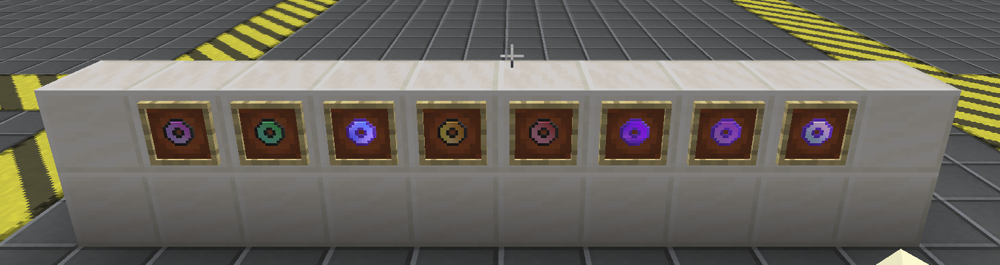<br><em>8 枚功能性戒指 / 8 Functional Rings</em></p>

A set of 8 functional rings that equip to Baubles ring slots, providing various buffs and abilities. Rings are obtained from chest loot, crafting, or the starter gift.

8 枚功能性戒指，装备于 Baubles 戒指栏，提供各种增益和能力。戒指可通过宝箱战利品、合成或新手宝箱获得。

### Baubles Ring Slot Expansion / Baubles 戒指栏扩展

The mod expands the Baubles ring slots from **2 to 10** via the Baubles-Expanded API, allowing the player to equip multiple rings simultaneously and stack effects.

模组通过 Baubles-Expanded API 将戒指栏从 **2 个扩展到 10 个**，使玩家可以同时装备多枚戒指并叠加效果。

- Calls `BaubleExpandedSlots.tryAssignSlotsUpToMinimum("ring", 10)` during PreInit
- Falls back to `overrideSlots()` during Init to ensure correct slot ordering
- Automatically compatible with other mods using `BaublesApi.getBaubles()` (dynamic `getSizeInventory()`)
- 在 PreInit 阶段调用 `BaubleExpandedSlots.tryAssignSlotsUpToMinimum("ring", 10)`
- 在 Init 阶段通过 `overrideSlots()` 兜底，确保槽位顺序正确
- 自动兼容其他使用 `BaublesApi.getBaubles()` 遍历的模组（动态 `getSizeInventory()`）

### Ring List / 戒指总览

| # | Name / 名称                       | Effect / 效果                                                                                | Stackable / 叠加 |
| - | ------------------------------- | ------------------------------------------------------------------------------------------ | :------------: |
| 1 | Ring of Distant Grasp / 戒指·遥握   | Interaction & attack range +2 per ring / 交互与攻击距离 +2                                        |       ✔️       |
| 2 | Ring of Skywalk / 戒指·凌步         | Auto step-up 1 block / 自动走上 1 格方块                                                          |       ✖️       |
| 3 | Ring of Windrider / 戒指·御风       | Creative flight / 创造飞行                                                                     |       ✖️       |
| 4 | Ring of Gluttony / 戒指·饕餮        | Continuous hunger restore + emergency fill / 持续恢复饥饿度 + 应急饱食                                |       ✖️       |
| 5 | Ring of Ironheart / 戒指·磐躯       | Max health +20 per ring (10 hearts) / 生命上限 +20                                             |       ✔️       |
| 6 | Ring of Dragon's Breath / 戒指·龙息 | Fire Resistance + Night Vision + Regeneration I + Resistance I / 抗火 + 夜视 + 生命恢复 I + 抗性提升 I |       ✖️       |
| 7 | Ring of Mountainbreaker / 戒指·裂山 | Strength II + Haste II / 力量 II + 急迫 II                                                     |       ✖️       |
| 8 | Ring of Tempest / 戒指·疾风         | Speed II + Jump Boost II / 速度 II + 跳跃提升 II                                                 |       ✖️       |

### Ring Details / 戒指详情

- **Ring of Distant Grasp / 戒指·遥握**: Extends block reach distance via Mixin (`MixinPlayerControllerMP`). Each ring adds +2 blocks. Stackable — multiple rings compound the bonus.
- **Ring of Skywalk / 戒指·凌步**: Automatically steps up 1-block heights without jumping. Walks smoothly like flat ground.
- **Ring of Windrider / 戒指·御风**: Grants creative flight with no cost. Obtained only via crafting.
- **Ring of Gluttony / 戒指·饕餮**: Restores 1 hunger/sec; restores saturation when full. Emergency-fills hunger and saturation when below 5 (60s cooldown).
- **Ring of Ironheart / 戒指·磐躯**: Uses `SharedMonsterAttributes.maxHealth` Attribute Modifier. Each ring adds +20 max health (10 hearts). Stackable.
- **Ring of Dragon's Breath / 戒指·龙息**: Refreshes 30s potion effects every 5s — no flickering.
- **Ring of Mountainbreaker / 戒指·裂山**: Refreshes 30s potion effects every 5s.
- **Ring of Tempest / 戒指·疾风**: Refreshes 30s potion effects every 5s.
- **戒指·遥握**：通过 Mixin（`MixinPlayerControllerMP`）扩展方块交互距离，每枚 +2 格，可叠加。
- **戒指·凌步**：自动走上 1 格高方块，如履平地，无需跳跃。
- **戒指·御风**：获得创造飞行，无消耗。仅通过合成获得。
- **戒指·饕餮**：每秒恢复 1 点饥饿值，满后恢复饱和度；饥饿度低于 5 时一次性补满（冷却 60 秒）。
- **戒指·磐躯**：使用 `SharedMonsterAttributes.maxHealth` 属性修饰器，每枚 +20 生命上限（10 颗心），可叠加。
- **戒指·龙息**：每 5 秒刷新 30 秒药水效果。
- **戒指·裂山**：每 5 秒刷新 30 秒药水效果。
- **戒指·疾风**：每 5 秒刷新 30 秒药水效果。

***

## Starter Gift / 新手宝箱

<p align="center">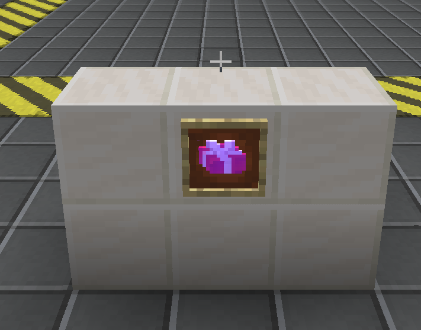<br><em>新手宝箱 / Starter Gift</em></p>

A gift box automatically granted to players on their **first login** to a world. Right-click to open and receive a set of starter items — guaranteed items plus randomly drawn items from a configurable pool.

玩家**首次进入某个世界**时自动获得的新手宝箱。右击打开即可获得一系列新手物资——包含必中物品和从随机物品池中抽取的随机物品。

- Auto-granted on first world login (tracked via persisted NBT)
- Right-click to open: grants guaranteed items + random items
- Items drop to the ground if inventory is full
- Fully configurable via `config/gtit/gift_config.json`
- Default random pool includes 6 rings (Skywalk, Gluttony, Ironheart, Dragon's Breath, Mountainbreaker, Tempest)
- 首次进入世界自动发放（通过持久化 NBT 追踪）
- 右击打开：获得必中物品 + 随机物品
- 背包满了物品丢到地上
- 通过 `config/gtit/gift_config.json` 完全可配置
- 默认随机池包含 6 枚戒指（凌步、饕餮、磐躯、龙息、裂山、疾风）

### Gift Config / 宝箱配置

```json
{
  "guaranteed_items": [
    { "item": "minecraft:bread", "amount": 16, "meta": 0 },
    { "item": "minecraft:torch", "amount": 64, "meta": 0 }
  ],
  "random_items": [
    { "item": "gtit:ring_skywalk", "amount": 1, "meta": 0 },
    { "item": "minecraft:enchanted_book", "amount": 1, "meta": 0, "nbtBase64": "..." }
  ],
  "random_count": 2
}
```

- `guaranteed_items`: Items always granted / 必中物品
- `random_items`: Random item pool / 随机物品池
- `random_count`: Number of random items drawn / 随机抽取数量
- `nbtBase64` (optional): Base64-encoded NBT data; written automatically when using `yesNBT` / 可选，Base64 编码的 NBT 数据；使用 `yesNBT` 时自动写入

***

## Reincarnation / 周目轮回

<p align="center">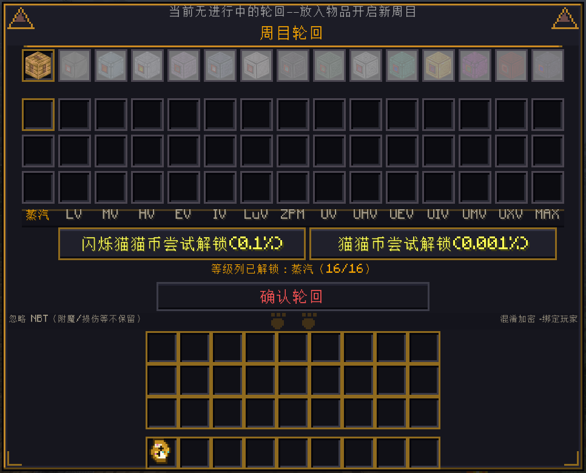<br><em>周目轮回 GUI / Reincarnation GUI</em></p>

A hardcore "new cycle" system built around the Reincarnation Crystal. Deposit items, confirm reincarnation, and your character ascends and dies — the world save is deleted — while the deposited items carry over to the next world as a reincarnation reward. Strictly single-player: the whole system disables itself when the world is shared over LAN.

围绕轮回水晶构建的硬核"新周目"系统。寄存物品、确认轮回后角色升天死亡——存档随之删除——寄存的物品则作为轮回奖励穿越到下一个世界。仅限严格单机：对局域网开放时周目系统整体停用。

### Cycle Flow / 轮回流程

- Right-click a **Reincarnation Crystal** to open the Reincarnation GUI / 右击**轮回水晶**打开周目 GUI
- Deposit items, then press **Confirm Reincarnation**: a 6-second ascension plays, the character dies, and the world save is deleted / 寄存物品后按下**确认轮回**：6 秒升天演出后角色死亡，存档删除
- Re-entering a world whose timeline has already been reincarnated triggers a 30-second countdown before the same ascension / 进入已被轮回过的时间线时，30 秒倒计时结束后同样升天
- Deposited items travel through the reincarnation mailbox and are granted **5 seconds** after the first login to the new world / 寄存物品经投胎信箱穿越，在新世界首次登录 **5 秒**后发放
- Reward items spiral down **one by one** — each becomes pickupable in the final 15% of its descent (~0.4 blocks away); excess drops to the ground when the inventory is full / 奖励物品**依次**螺旋降落——每件在降落末段 15%（距玩家约 0.4 格）即可拾取；背包满则掉落地面
- Spark trail particles stop in the final 20% of each item's descent to keep the view clear / 每件物品降落的最后 20% 停撒拖尾粒子，避免遮挡视野
- Enchantments and damage NBT are not preserved (the deposit ignores NBT) / 附魔、损伤等 NBT 不保留（寄存忽略 NBT）
- Cycle data is obfuscated, encrypted and bound to the player / 周目数据混淆加密、绑定玩家

### Progression / 进度解锁

- **15 hull columns** (Steam → MAX): feed machine hulls into a column's slot — 16 hulls unlock the column / **15 个等级列**（蒸汽 → MAX）：向列槽放入机器外壳，累计 16 个解锁该列
- **3 unlockable rows** via Neko Coin rolls: press an unlock button to toggle continuous rolling (1 coin per tick while active); Shimmer Neko Coin has a 0.1% and Neko Coin a 0.001% success rate per roll / **3 行解锁**靠猫猫币连掷：按下解锁按钮开始连掷（激活期间每 tick 消耗 1 枚），闪烁猫猫币单掷 0.1%、猫猫币单掷 0.001% 成功率
- Unlocked rows and columns determine the deposit slots available for the next cycle / 已解锁的行与列决定下次轮回可用的寄存格

***

## Machine Sound Mute / 机器音效静音

Two QoL configs controlling GT5U machine sounds. Config file: `config/gtit/gtit_mute.json`.

两项 GT5U 机器音效静音配置。配置文件：`config/gtit/gtit_mute.json`。

```json
{
  "_comment_mute": "mute_machine_working_sounds=true 时：新放置机器默认静音（有 GUI 按钮的机器可单独取消静音）。",
  "mute_machine_working_sounds": false,
  "_comment_extra_mute": "extra_mute=true 时：额外强制拦截无静音按钮机器的音效（锅炉蒸汽排放音/锅炉沸腾加热循环音/管道蒸汽泄漏音），不受 GUI 按钮控制。",
  "extra_mute": false
}
```

### `mute_machine_working_sounds`

- **`false` (default)**: No intervention. Players can toggle each machine's mute button in its GUI.
- **`true`**: Newly placed machines (or those without a saved mute state) default to muted; players can still unmute per-machine via the GUI button.
- **`false`（默认）**：不干预，玩家可通过每台机器 GUI 右上角的静音按钮单独控制。
- **`true`**：新放置或未保存过静音状态的机器默认静音；玩家仍可通过 GUI 按钮单独取消。

### `extra_mute`

For machines **without** a GUI mute button (boilers, fluid pipes). Force-cancels their sounds regardless of any state.

针对**没有** GUI 静音按钮的机器（锅炉、流体管道）。无论状态如何，强制拦截其音效。

- **`false` (default)**: No intervention.
- **`true`**: Force-cancel boiler steam-vent sound (`ventSteamIfTankIsFull` → `sendSound`), boiler boiling/heating loop sounds, and fluid pipe steam-leak sound.
- **`false`（默认）**：不干预。
- **`true`**：强制拦截锅炉蒸汽满罐排放音（`ventSteamIfTankIsFull` → `sendSound`）、锅炉沸腾/加热循环音、流体管道蒸汽泄漏音。

### Mixin Architecture / Mixin 架构

| Mixin                              | Target                              | Config                | Function / 功能                                                                                |
| ---------------------------------- | ----------------------------------- | --------------------- | ---------------------------------------------------------------------------------------------- |
| `MixinBaseMetaTileEntityMuffle`    | `setInitialValuesAsNBT` (TAIL)      | `mute_machine_working_sounds` | Default new machines to `mMuffler=true`; GUI button still works per-machine                   |
| `MixinMTEBrickedBlastFurnace`      | `updateSound` (HEAD)                | `mute_machine_working_sounds` | Cancel brick blast furnace flame loop sound                                                    |
| `MixinMTEBlackHoleCompressor`      | `playBlackHoleSounds` (HEAD)        | `mute_machine_working_sounds` | Cancel black hole compressor loop sound                                                        |
| `MixinMTEBoilerVentSteam`          | `MTEBoiler.doSound` (HEAD)          | `extra_mute`          | Cancel boiler steam vent sound + particle (`SOUND_EVENT_LET_OFF_EXCESS_STEAM`)                 |
| `MixinMTEBoilerSoundLoops`         | `updateSoundLoops` (HEAD)           | `extra_mute`          | Cancel boiler boiling/heating loop sounds (`GTCEU_LOOP_BOILER` / `GTCEU_LOOP_FURNACE`)         |
| `MixinMTEFluidPipeSound`           | `MTEFluidPipe.doSound` (HEAD)       | `extra_mute`          | Cancel fluid pipe steam-leak sound (`aIndex==9`, `RANDOM_FIZZ`)                                |

***

## Multiblock Test Machine / 多方块测试机器

A development-stage test multiblock (HV tier, 3×3×3 hollow TungstenSteel) once used to verify the multiblock registration process, structure detection logic, and recipe system integration. It was removed in v1.6.30 — the Neko Vending Machine V2, built directly on GT5U's `MTEEnhancedMultiBlockBase`, has since taken over this role.

开发阶段用于验证多方块机器注册流程、结构检测逻辑及配方系统的测试多方块（HV 级，3×3×3 空心钨钢结构）。该测试机已于 v1.6.30 移除——直接基于 GT5U `MTEEnhancedMultiBlockBase` 构建的猫猫售货机 V2 已承接其职责。

***

## Administrator Commands / 管理员命令

All commands under `/gtit`, OP permission level 2. **Tab completion supported** for subcommands, tab IDs, order IDs, and player names. Subcommands that manipulate the executor's own inventory are player-only; the rest also work from the server console.

所有指令通过 `/gtit`，OP 权限等级 2。**支持 Tab 补全**——子命令、标签页 ID、顺序 ID、玩家名均可自动补全。需要操作执行者背包的子命令仅玩家可执行，其余支持服务器控制台。

### Starter Gift / 新手宝箱

| Command / 指令                                | Description / 说明                                                               |
| ------------------------------------------- | ------------------------------------------------------------------------------ |
| `/gtit gift certain [yesNBT\|noNBT]`        | Set guaranteed items from current inventory / 将当前背包物品设为必中物品；默认 `noNBT`       |
| `/gtit gift random <count> [yesNBT\|noNBT]` | Set random pool from inventory + draw count / 将背包物品设为随机池并设置抽取数；默认 `noNBT`   |
| `/gtit gift reset`                          | Reset to default config / 恢复默认配置                                                 |
| `/gtit gift claimlist`                      | List players who claimed the gift (online + offline) / 列出已领取玩家（在线+离线）          |
| `/gtit gift claimreset [all\|玩家名]`         | Reset claim status; re-gift on next login / 重置领取状态，玩家下次登录时自动发放（支持离线玩家） |

### NekoVM / 猫猫售货机

| Command / 指令                | Description / 说明                                                        |
| --------------------------- | ------------------------------------------------------------------------ |
| `/gtit nekovm edit on\|off` | Toggle visual config edit mode / 开关可视化配置编辑模式                              |
| `/gtit nekovm reload`       | Hot-reload trade + tab config / 热重载交易与标签页配置                                |
| `/gtit nekovm timereset`    | Reset all trade cooldowns of the executor's team / 重置当前玩家（团队）的全部交易冷却 |
| `/gtit nekovm help`         | Full help / 完整帮助                                                              |

### Sign-In / 每日签到

| Command / 指令                              | Description / 说明                                                        |
| ----------------------------------------- | ------------------------------------------------------------------------ |
| `/gtit signin`                            | Player self sign-in, same as the GUI button / 玩家自助签到，与签到 GUI 按钮等效（仅玩家） |
| `/gtit signin info [玩家名]`                | View sign-in status (online players only) / 查看签到状态（目标仅支持在线玩家）        |
| `/gtit signin reload`                     | Hot-reload sign-in + online-time reward config / 热重载签到与在线时长奖励配置        |
| `/gtit signin admin set <玩家名> <天数>`     | Set consecutive sign-in days / 设置连续签到天数（在线玩家）                          |
| `/gtit signin admin reset <玩家名>`         | Reset a player's sign-in data / 重置玩家签到数据（在线玩家）                          |
| `/gtit signin help`                        | Full help / 完整帮助                                                              |

### Lottery / 抽奖

| Command / 指令           | Description / 说明                        |
| ---------------------- | ---------------------------------------- |
| `/gtit lottery reload` | Hot-reload lottery pool config / 热重载抽奖卡池配置 |
| `/gtit lottery help`   | Full help / 完整帮助                                 |

### Mail / 邮件

| Command / 指令                              | Description / 说明                                                                                       |
| ----------------------------------------- | ------------------------------------------------------------------------------------------------------ |
| `/gtit mail send <玩家名> <标题> [正文...]`   | Send mail; attachment = held item (console sends as "系统" without attachment) / 发送邮件；附件=执行者手持物品（控制台以「系统」名义发送、无附件） |
| `/gtit mail first <标题> [正文...]`           | Set first-login reward template, overwrites the old one / 设置首登奖励模板（覆盖旧模板；仅玩家）                  |
| `/gtit mail firstclear`                   | Clear the first-login reward template / 清除首登奖励模板                                                  |
| `/gtit mail once <奖励ID> <标题> [正文...]`    | Publish a one-time reward; every player receives it once / 发布一次性奖励，全体玩家各收一次（奖励 ID 不可重复）      |
| `/gtit mail help`                      | Full help / 完整帮助                                                                                      |

A literal `\n` in mail bodies is converted to a line break. / 邮件正文中字面 `\n` 会被转换为换行。

### Server Management Terminal / 服务器管理终端

| Command / 指令    | Description / 说明                                                                                     |
| ---------------- | ---------------------------------------------------------------------------------------------------- |
| `/gtit terminal` | Open the server management terminal (mail / sign-in / trade-cooldown / gift-audit panels); in-game OP2 players only — unavailable and unlisted on physical dedicated servers / 打开服务器管理终端（邮件/签到/交易冷却/礼包审计四页面板）；仅游戏内 OP2 玩家可用，物理专用服务器上不可用且 Tab 补全不提示 |

***

## Tech Stack / 技术栈

- Jabel (modern Java syntax, Java 8 bytecode) / Minecraft 1.7.10 / Forge 10.13.4.1614
- ModularUI / ModularUI2 / StructureLib
- Dependencies: GT5-Unofficial (5.09.54.133), GTNHLib, VisualProspecting, Baubles-Expanded, IC2; VendingMachine 0.4.100 (dev local jar; the V2 multiblock's structure casing and uplink hatch are still provided by VendingMachine at runtime), BetterQuesting 3.8.72 (compileOnly)
- Jabel（现代 Java 语法，编译为 Java 8 字节码）/ Minecraft 1.7.10 / Forge 10.13.4.1614
- 依赖：GT5-Unofficial（5.09.54.133）、GTNHLib、VisualProspecting、Baubles-Expanded、IC2；VendingMachine 0.4.100（dev 本地 jar；V2 多方块的结构外壳与上行仓仍由 VendingMachine 提供运行时支持）、BetterQuesting 3.8.72（compileOnly）

***

## License / 许可证

Released under the AGPL-3.0 License. See the LICENSE file for details.

以 AGPL-3.0 许可证发布，详见 LICENSE 文件。

***

## Acknowledgments / 致谢

- **[AE2Things](https://github.com/asdflj/AE2Things)** — The Infinity Cell implementation is adapted from AE2Things' storage cell code (GTNH 2.8.4 version), rewritten for the GTNH 2.9.0 AE2 API.
  无限存储元件的最初实现移植自 AE2Things 的存储元件代码（GTNH 2.8.4 版本），为 GTNH 2.9.0 AE2 API 重写；v1.8.22 起已被 GTIT 自有的多通道「猫猫无限存储单元」取代，移植版两枚降级为 `[OLD]` 保留。
- **[VendingMachine](https://github.com/GTNewHorizons/VendingMachine)** — The Neko Vending Machine originated on top of the VendingMachine framework, with custom currency, GUI, and trade logic, before being rebuilt as the independent V2 multiblock on GT5U.
  猫猫售货机最初基于 VendingMachine 框架构建（自定义货币、界面与交易逻辑），后重构为基于 GT5U 的独立 V2 多方块机器。
